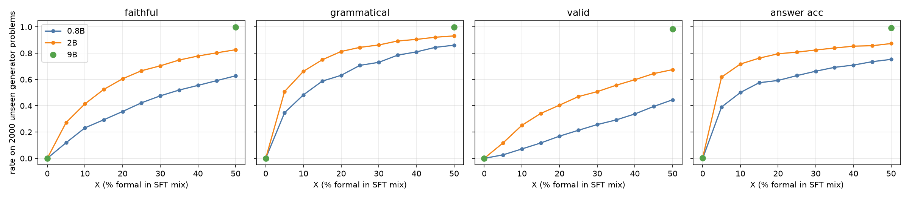
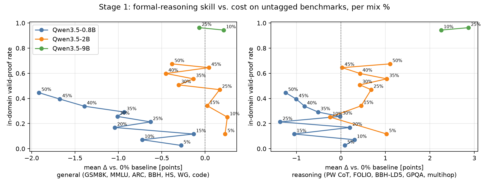
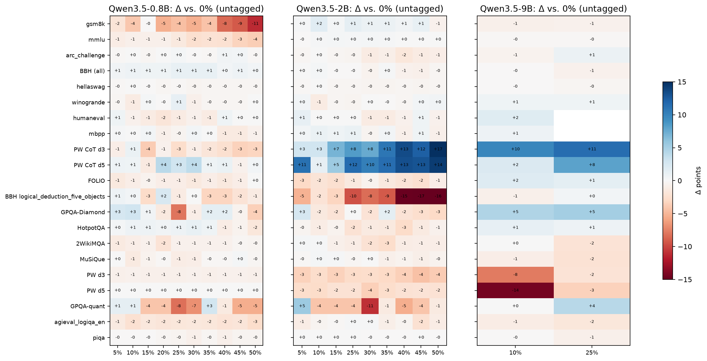

# Stage 1 interim report: formal-mixture sweep (2026-09-28)

Plan: `docs/research_plan.md`, Stage 1.

**Setup:**
- **Models:** Qwen3.5-Base 0.8B and 2B.
- **Data:** SFT on Dolci-100k, with X% replaced by rlvlgen formal proofs (tag `<formal>`).
- **9B:** p0 is trained; p50, p25 and p10 are training on gruenau11. They will be added later.

## 1. In-domain: unseen generator problems (n=2000 per cell)

| model | X | faithful | grammatical | valid | answer acc | Dolci loss |
|---|---|---|---|---|---|---|
| 0.8B | 0 | .000 | .000 | .000 | .000 | 1.016 |
| 0.8B | 10 | .232 | .483 | .071 | .501 | 1.018 |
| 0.8B | 25 | .422 | .708 | .213 | .629 | 1.055* |
| 0.8B | 50 | .628 | .861 | .446 | .753 | 1.028 |
| 2B | 0 | .000 | .000 | .000 | .005 | .868 |
| 2B | 10 | .414 | .662 | .252 | .718 | .870 |
| 2B | 25 | .666 | .845 | .470 | .808 | .873 |
| 2B | 50 | .827 | .931 | .675 | .874 | .879 |
| 9B | 0 | .000 | .000 | .000 | .001 | – |
| 9B | 50 | .999 | .999 | .983 | .992 | – |

\*The 0.8B p25 run trained on 1 GPU with grad-accum 128 (a busy-card fallback), so its loss is not directly comparable.

**Findings:**
- All four skills rise monotonically with X and have not saturated at 50%. The 2B model learns about 1.5–2× more per percent than the 0.8B.
- Faithful translation (prompt → premises) is the bottleneck: 2B p50 is 83% faithful but 93% grammatical.
- The cost on held-out Dolci loss is small (+0.011 for 2B at 50%).
- *Update 22:55:* **9B p50 almost solves the in-domain task.** It is 99.9% faithful, 98.3% valid and 99.2% correct on the answer; 2B p50 is at 83% / 68% / 87%. The faithfulness bottleneck is a capacity limit that 9B removes. The figure now draws the full 0.8B and 2B curves (X = 0, 5, ..., 50) and the 9B points; 9B p25 and p10 are still training.

## 2. Transfer without the tag (untagged lm-eval suite, "Lead into Gold" protocol)

**2B:**
- The mixture is essentially free on general benchmarks: the mean Δ stays within ±0.4 points up to 50%.
- On the reasoning set the gain grows with X, reaching +1.1 points at 50%. The main driver is ProofWriter with CoT: +17 (d3) and +14 (d5) at 50%.

**Costs for 2B:**
- BBH logical_deduction_five_objects falls by 16 points at 50% and by 10 at 25%.
- Direct-answer ProofWriter falls by 2–4 points.
- The likely cause is that ordering and constraint puzzles are not a family in the generator, while the model's reasoning style shifts toward formal chains. This is a generator coverage gap to fix.

**0.8B:** the small model pays a capacity cost.
- GSM8K drops by up to 11 points at 50%; MMLU by 1–4 points.
- The general mean Δ is −1.9 at 50%, and there is no PW CoT gain.

**BBH web_of_lies** is 100% for every model and X. The chain-of-thought answers are genuinely correct and the targets are balanced, so this is not a scoring bug; the task is saturated or contaminated for Qwen3.5 and carries no signal.

**Tentative best X (plan criterion: max in-system rate with ≤ 2 points general loss):**
- **2B:** 50%. General Δ is −0.4, so the criterion does not bind yet. Test >50% only if the tagged eval confirms the trend.
- **0.8B:** 25–35%, where the general Δ is about −0.6 to −1.0. At 40–50% the GSM8K loss is too large.

## 3. Tagged eval on real benchmarks (the Stage-2 gate)

This eval asks each benchmark item with `<formal>` and checks the proof. Smoke test 6899 (0.8B p50, 5 items per benchmark, n=210):

| metric | all | system-answerable |
|---|---|---|
| has proof | .91 | 1.00 |
| grammatical | .20 | .38 |
| valid | .03 | .06 |
| in-system correct | .02 | .06 |

ProofWriter: 68% grammatical, 20% valid, 16% in-system.

**Observations:**
- **HotpotQA and MuSiQue:** the model skips the proof and answers directly on the long LongBench contexts. The generator has no long-context retrieval problems.
- **Unfaithful premise translation:** for example, "The tiger chases the dog" was formalised as `sees(tiger, dog)`. The checker's quote grounding only tests substring presence, not whether the formula matches the quote.

**Implication for Stage 2:** at 0.8B the in-system rate on real problems is far below the in-domain rate. The full runs (jobs 6900–6925, all X, 0.8B/2B/9B) will show whether 2B and 9B at high X clear the gate. If they don't, the planned remedy is generator families closer to the RL data (math word problems, ordering puzzles, long-context retrieval) before GRPO.

## Pending
- Full tagged eval for all checkpoints.
- 9B results.
- 2B untagged benches and tagged evals for the last cells (p20 6824/6919 are running). The in-domain eval of every 2B cell is done.

## Update 01:35 (2026-09-29): 2B tagged benchmarks complete (p0–p50)

With 2B p20, p40 and p45 in (7032–7034), all 11 fractions of the 2B tagged sweep are done. Tables are in `analysis/formal_mixture_sweep_20260925/tagged/tagged_2b.md` and curves in `tagged/tagged_curves.png` (`scripts/analysis/formal_mix_tagged_table.py`). All numbers are % of items with the `<formal>` tag, as grammatical / valid / correct / in-system.

| subset | p0 | p5 | p10 | p20 | p30 | p40 | p50 |
|---|---|---|---|---|---|---|---|
| deduction, all (2703) | 0/0/27/0 | 29/6/29/5 | 44/9/34/7 | 53/11/40/9 | 59/13/40/10 | 61/15/41/11 | 63/15/42/11 |
| answerable overall (3187) | 0/0/34/0 | 22/4/38/4 | 35/7/43/6 | 43/9/48/9 | 48/11/49/9 | 48/11/51/10 | 52/12/52/10 |
| GSM8K (500) | 0/0/42/0 | 12/1/38/1 | 26/3/34/1 | 34/5/34/4 | 40/5/35/3 | 44/4/38/3 | 51/6/37/4 |

On deduction, grammaticality, validity and correctness all rise with X and flatten beyond about 30%. Tagged GSM8K accuracy drops 4–8 points at every X > 0, and only 4–6% of its proofs are valid. The tagged math proofs mostly fail the checker, and forcing the format costs math accuracy.

## Update 2026-09-29 ~19:15 — 9B p10 (eval 6844, tagged 6923 on gruenau11)

In-domain (2000 unseen generator problems): 9B p10 faithful .976 / grammatical .997 / valid .944 / answer .979; p25 .963 valid, p50 .983 — at 9B, 10k generator rows (10% of 100k) already give 94% valid proofs, and Dolci eval loss is flat across X (.650 / .651 / .653 / .658). Tagged benchmarks (grammatical / valid / correct / in-system, %): overall 37 / 12 / 0 / 9; ProofWriter 77 / 34 / 55 / 32; FOLIO 66 / 21 / 54 / 15; BBH 25 / 3 / 52 / 1; GSM8K 82 / 12 / 77 / 10; GPQA 1 / 0 / 43 / 0. p25/p50 tagged and all 9B untagged benches are running (gruenau11 lanes). Figures regenerated: `stage1_indomain_curves.png`, `stage1_tradeoff.png`, `stage1_bench_delta_heatmap.png`, `sft_scale_curve.png`, `analysis/formal_mixture_sweep_20260925/tagged/tagged_curves.png`.

## Update 2026-09-29 ~20:20 — 9B tagged p10 / p25 / p50

Tagged overall (grammatical / valid / correct-on-answerable / in-system, %): p10 37 / 12 / – / 9, p25 33 / 12 / – / 11, p50 33 / 12 / – / 11; ProofWriter valid 34 → 40 → 40, FOLIO 21 → 18 → 19, BBH 3 → 2 → 2. At 9B, transfer of valid proofs to benchmarks saturates at the 10–25% mixture; more formal data beyond 25% buys nothing tagged. Table: `analysis/formal_mixture_sweep_20260925/tagged/tagged_9b.md`; figures regenerated.

## Update 2026-09-29 ~21:10 — 9B untagged benchmarks complete (p0 / p10 / p25 / p50)

9B is the only size trained with fp32 master weights throughout (ZeRO-2), so these are the clean Stage-1 numbers. Accuracy (%), delta vs the pure-Dolci p0 in brackets (full table: `analysis/formal_mixture_sweep_20260925/bench/`, figures `stage1_bench_delta_heatmap.png`, `stage1_tradeoff.png`):

| benchmark | p0 | p10 | p25 | p50 |
|---|---:|---:|---:|---:|
| ProofWriter CoT d0–d5 (mean) | 54.4 | 63.6 (+9.2) | 65.7 (+11.3) | 60.7 (+6.3) |
| ProofWriter direct d0–d5 (mean) | 50.3 | 49.2 (-1.1) | 51.6 (+1.4) | 46.5 (-3.8) |
| FOLIO | 65.0 | 67.0 | 66.5 | 64.0 |
| BBH (all) | 84.4 | 84.4 | 83.8 | 84.2 |
| BBH formal_fallacies | 72.8 | 66.0 (-6.8) | 68.4 (-4.4) | 61.6 (-11.2) |
| GPQA-Diamond (n=198, SE ~3.5) | 45.5 | 50.0 | 50.5 | 50.0 |
| MuSiQue | 46.0 | 44.9 | 43.8 | 41.0 (-5.0) |
| GSM8K / MMLU / ARC-C | 87.0 / 78.0 / 60.9 | 86.2 / 77.8 / 60.4 | 86.3 / 77.8 / 61.8 | 86.4 / 77.8 / 61.1 |
| HumanEval / MBPP | 65.2 / 63.4 | 67.1 / 64.2 | 69.5 / 64.4 | 67.7 / 64.2 |

- Untagged general capability is preserved at every X (GSM8K, MMLU, ARC, HellaSwag, PIQA, code all within ±2).
- Multi-step deductive reasoning in natural-language CoT improves (ProofWriter CoT +9–11 at p10/p25, largest at depth 2–3), peaking at p25 and falling back at p50.
- Costs grow with X: BBH formal_fallacies (-7 to -11) and MuSiQue (-5 at p50).
- Stage-1 recommendation at 9B: X = 25% (best CoT transfer, in-domain valid .963, tagged validity already at its plateau, no general-benchmark cost). Single seed; GPQA/FOLIO deltas are within noise.

## 2026-09-29 23:25: p50 x3, checkpoint-781 (first point of the longer SFT, ~50k generator rows)

Run: `qwen35_2b_dolci_rlvlgen_p50_x3` (p50 recipe at 3x the rows, 2342 steps; ZeRO-2 with fp32 master weights, so it does not have the bf16 precision bug). Checkpoint-781 has seen ~50k generator rows, as many as the original p50 final. Its LR is not decayed yet (cosine over 2342 steps). Figure: `figures/sft_scale_curve.png`.

In-domain (2000 unseen generator problems):

| model | generator rows | faithful | grammatical | valid | answer acc |
|---|---|---|---|---|---|
| 2B p50 (bf16 DDP, crippled) | 50k | — | — | .675 | — |
| **2B p50 x3 @781 (fp32 master)** | ~50k | .986 | .996 | **.942** | .976 |
| 9B p10 | 10k | — | — | .944 | — |
| 9B p50 | 50k | — | — | .983 | — |

Dolci gate (`rl_gate_dolci`, answers must also be proven):

| model | has_proof | grammatical | format_ok | valid_eval | valid | in-system | correct |
|---|---|---|---|---|---|---|---|
| SFT p50 | .399 | .082 | .328 | .008 | .004 | .002 | .222 |
| SFT p50 + lemma catalog (fp32) | .598 | .189 | .484 | .011 | .007 | .003 | .224 |
| **SFT p50 x3 @781** | .299 | .134 | .275 | .023 | .007 | .004 | .214 |

**Reading.** With correct precision, the 2B model reaches 9B-level in-domain validity after the same 50k generator rows: .942 vs .675. So most of the earlier 2B/9B gap was the precision bug, not model size. Transfer to Dolci does not follow. valid_eval doubles (.008 → .023, the best SFT so far), but end-to-end valid stays at .007 and the model writes fewer proofs (has_proof .30). In-domain competence is now saturated at 2B. The remaining bottleneck is transfer to natural prompts. That is the Stage-2 GRPO / EI question, not a question of longer SFT. Checkpoints 1562 and final follow (the watcher submits their eval and gate automatically), and the corrected 2B p00/p10/p25/p50 reruns (7146/7215/7217/7147) give the matched mixture curve.

## 2026-09-30 03:45: corrected 2B sweep, first points (p10, p25 with fp32 master weights)

These rerun the 2B mixture sweep without the bf16 rounding bug (2dea2ee). Same data, lr and steps. In-domain rates are on 2000 unseen generator problems:

| run | faithful | grammatical | valid | answer acc |
|---|---|---|---|---|
| p10 bf16-rounded | .414 | .662 | .252 | .718 |
| **p10 fp32m** | **.923** | **.980** | **.845** | **.934** |
| p25 bf16-rounded | .666 | .845 | .470 | .808 |
| **p25 fp32m** | **.970** | **.994** | **.913** | **.964** |
| p50 x3 @781 (fp32, same 50k gen rows as p50) | .986 | .996 | .942 | .976 |
| 9B p10 / p25 | .976 / .992 | .997 / .997 | .944 / .963 | .979 / .989 |

- The steep 2B "more formal data helps" slope in the original sweep was mostly an optimizer artefact.
- With correct precision, 10k generator rows already give valid .85, and 25k give .91. 2B now sits just below 9B.

Dolci gate (950 natural prompts, greedy; `scripts/analysis/grpo_gate_ckpts.py`):

| model | has_proof | grammatical | format_ok | valid_eval | valid | correct |
|---|---|---|---|---|---|---|
| SFT p0 | .000 | .000 | .000 | .000 | .000 | .203 |
| SFT p50 bf16-rounded | .399 | .082 | .328 | .008 | .004 | .222 |
| SFT p10 fp32m | .597 | .173 | .498 | .026 | .005 | .206 |
| SFT p25 fp32m | .402 | .171 | .360 | .021 | .008 | .206 |
| SFT p50 x3 @781 | .299 | .134 | .275 | .023 | .007 | .214 |

- Correct precision roughly doubles grammatical proofs on natural prompts, from .08 to .17.
- Strict validity on natural prompts stays below 1% at every mixture ratio.
- Answer correctness is unchanged versus pure instruction tuning (p0 .203). The formal mix costs no accuracy on the gate.
- Benchmark and tagged results follow once 7222/7225 and 7223/7226 finish.
