# Stage 2 gate: can the Stage-1 policies write checkable proofs on the RL prompts? (2026-09-28)

Plan: `docs/research_plan.md`, "Gate to Stage 2". **Verdict: the gate fails.** On the Olmo 3 RL prompts, the greedy in-system rate is 0.2–0.3% for every checkpoint tested. The validity arms (G2–G4) would get almost no reward signal. Following the plan, a remedy comes before GRPO (section 5).

## 1. Setup

**Gate set** (`scripts/build_rl_gate_set.py`): 950 held-out prompts from `allenai/Dolci-Instruct-RL`. The same rows are excluded from GRPO training.

| subset | n | source | answer |
|---|---|---|---|
| dolci_math | 300 | OpenMath-style generated math | number |
| dolci_dapo | 150 | DAPO competition math | integer |
| dolci_wordprob | 200 | Tulu-3 persona word problems | number |
| dolci_yesno | 200 | Tulu-3 / math items with a yes/no answer | yes/no |
| dolci_knowledge | 100 | multi-subject short answers | text; not system-answerable |

**Protocol:**
- Prompt: `<formal>\n{prompt}`, greedy decoding, 2048 new tokens.
- Scored by `scripts/eval_formal_bench_vllm.py` with the Stage-2 reward components (`scripts/formal_rewards.py`).
- p0 checkpoints get the same tag. They have never seen it, so they answer in natural language; this gives their correct rate.

**Scoring fix made today:**
- Answer extraction now also accepts `**Answer:** x` and `the answer is x` lines. Before this, 93% of the 9B p0 answers were not extracted.
- All finished runs were re-scored (`scripts/rescore_formal_bench.py`); the old summaries are kept as `summary.pre_rescore.json`.
- Only the correct rate of natural-language outputs changed: 9B p0 went from .211 to .259, 0.8B p0 from .118 to .161, and the formal checkpoints by ≤ .015.

## 2. Results (greedy, all 950 items)

| model | X | has proof | grammatical | valid | correct | in-system |
|---|---|---|---|---|---|---|
| 0.8B | 0 | .000 | .000 | .000 | .161 | .000 |
| 0.8B | 25 | .780 | .047 | .004 | .128 | .003 |
| 0.8B | 50 | .807 | .062 | .005 | .135 | .002 |
| 2B | 0 | .000 | .000 | .000 | .203 | .000 |
| 2B | 25 | .398 | .066 | .008 | .213 | .002 |
| 2B | 50 | .399 | .082 | .008 | .222 | .003 |
| 9B | 0 | .000 | .000 | .000 | .259 | .000 |
| 9B | 50 | .765 | .200 | .032 | .316 | .020 |

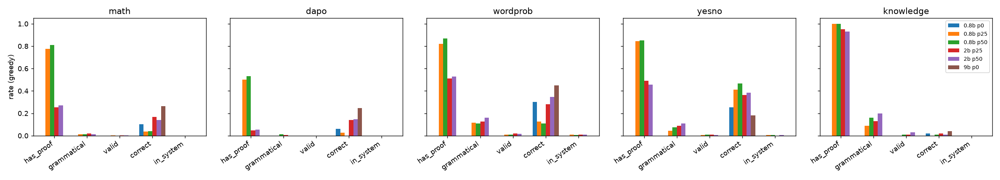

**By subset** (has proof / grammatical / correct):

| model | math | dapo | wordprob | yesno | knowledge |
|---|---|---|---|---|---|
| 0.8B p50 | .81 / .01 / .04 | .53 / .01 / .00 | .87 / .11 / .11 | .85 / .07 / .47 | 1.0 / .16 / .01 |
| 2B p50 | .27 / .01 / .14 | .05 / .00 / .15 | .53 / .16 / .34 | .46 / .11 / .39 | .93 / .20 / .01 |
| 9B p0 | – / – / .26 | – / – / .25 | – / – / .45 | – / – / .18 | – / – / .04 |
| 9B p50 | .87 / .09 / .17 | .73 / .09 / .19 | .73 / .31 / .56 | .57 / .31 / .53 | 1.0 / .27 / .05 |

**Observations:**
- **The tag is obeyed less on hard math.** 2B p50 writes a proof on only 27% of math and 5% of DAPO prompts. It falls back to natural language, which is a reasonable choice since the system cannot express most of these problems. 0.8B p50 always tries, and fails.
- **The effect on correctness depends on size.** At 0.8B the mixture costs correctness under the tag (p50 .135 against p0 .161); at 2B it helps slightly (p50 .222 against p0 .203). A likely reason, not yet tested: 2B falls back to natural language where the system cannot express the problem. Formal attempts on math are almost never grammatical.
- **Word problems are the closest subset** (2B p50: 16% grammatical, 34% correct), but they are still almost never valid.

## 3. Why the proofs fail

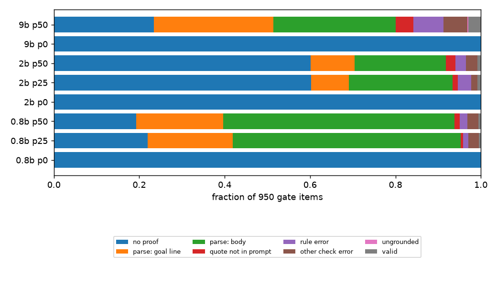

For 2B p50, 571 of 950 outputs have no proof, and 301 of the rest fail to parse. Of those parse errors, 98 are on the `goal` line.

**Failure modes, most frequent first:**
1. **The problem is outside the system.**
   - Goal lines use notation that the grammar lacks: `|x|`, set-builder notation, intervals, `∩`, `hcf(...)`, systems of equations "for n".
   - Most of DAPO and a large part of dolci_math are of this kind. No amount of RL on this system can make them valid.
2. **Prose in place of rules.** Justifications are written in English, e.g. `1 count(player, time) = count(time) * 2 ; each team has 2 players`, where the system needs `given "…"`.
3. **Wrong `subst`/`inst` citations.** Some proofs are almost right. Example: the cookie problem proof is correct except for one `subst` line.
4. **Length.** 190 outputs of 2B p50 hit 2048 tokens, most of them repeated `given` lines.

**Valid proofs are not always faithful** (valid but not correct). Two examples of the plan's "valid ≠ faithful" risk:
- `goal size(sampling_group) = 10 ? … ans yes`: it proves a restated premise, not the question. The ans/Answer agreement check in `formal_rewards.valid` catches it, because the Answer: line disagrees.
- A golf word problem drops "2 aspects per swing": the proof is valid, and the answer 75 is wrong (150).

```
goal height(fifth) = ?
1 height(fifth) = height(fourth) + 1 ; given "The fifth athlete cleared a height 1 foot higher than the fourth athlete"
2 height(fourth) = height(third) + 0.5 ; given "The fourth athlete cleared a height 0.5 feet higher than the third athlete"
...
ans 7 ; ...
```
*One of the three in-system proofs of 2B p50 (dolci_wordprob/148042).*

## 4. Consequences for Stage 2

- **RL prompt set.** Restrict Stage 2 to prompts the system can express: math (non-competition), wordprob and yesno; drop DAPO. The `dolci_math` goal-line failures suggest filtering further by whether any sample from the policy parses.
- **Cold start.** With greedy in-system ≈ 0.3%, the question is whether sampling finds proofs. The **sampling probe** measures this: `scripts/rl_signal_probe.py`, jobs 6944/6945 (resubmits of 6936/6937), 16 samples at T = 0.6 and 1.0 on 100 items per subset. It reports pass@16 and the fraction of GRPO groups with nonzero reward variance per arm.

**Probe result, 0.8B p50** (job 6944; 16 samples per item, 100 items per subset; pass@16 and the fraction of groups whose rewards are not all equal):

| T | subset | pass grammatical | pass valid | pass in-system | signal correct | gvc | lines | valid |
|---|---|---|---|---|---|---|---|---|
| 0.6 | math | .12 | .00 | .00 | .24 | .32 | .26 | .00 |
| 0.6 | dapo | .07 | .00 | .00 | .23 | .27 | .15 | .00 |
| 0.6 | wordprob | .45 | .06 | .03 | .61 | .74 | .58 | .06 |
| 0.6 | yesno | .44 | .03 | .03 | .80 | .81 | .55 | .03 |
| 0.6 | all | .27 | .022 | .015 | .47 | .535 | .385 | .022 |
| 1.0 | all | .205 | .007 | .005 | .47 | .535 | .37 | .007 |

- Sampling does not rescue the validity arms: with 16 samples, a valid proof exists for only 2% of prompts, so G2/G4 would see signal on about 1 prompt in 45.
- The dense `lines` arm has signal on 37–39% of groups. Unlike gvc, whose extra signal over correct comes from the 0/1 grammatical term, this signal comes from partial proofs. That is the premise of the G5 pilot.
- T = 0.6 beats T = 1.0 on every validity measure.

## 5. Remedy (started)

**Expert iteration (rejection-sampling SFT) on the RL prompt distribution.** It is cheaper and more on-distribution than new generator families, and it is the natural warm start for G2–G4.
1. **Collect.** `rl_signal_probe.py --source train` samples 8 completions at T = 1 on 1,500 RL training prompts per subset (math, wordprob, yesno). Job 6938 did this for 2B p50 (result below).
2. **Build.** `scripts/data/build_ei_mixture.py` keeps the in-system samples: valid, grounded, ans = Answer = reference, at most 2 per prompt. It adds 20k replay rows from the p50 mixture.
3. **Train and repeat.** Continue SFT from p50 (`gruenau_formal_mix_train_2026-09-25.slurm` with `INIT_MODEL`/`MIX_DIR`). Re-run the gate, then repeat until the gate passes or the yield plateaus.

**Fallbacks:**
- If EI yields too few proofs: new generator families for multi-sentence word problems (rates, fractions of quantities, multi-step `subst`), and a feasibility yes/no family.
- The gvc arm (G3) has a denser grammatical term, which gives signal earlier than validity alone.

### Round 1 result: whole-proof rejection sampling is too sparse
Job 6938 (2B p50, 8 samples at T = 1 on 3,191 RL training prompts; `ei_collect_r1/probe.json`):

| subset | prompts | has proof (mean) | grammatical (mean / pass@8) | valid (pass@8) | in-system (pass@8) | GRPO signal: correct / correct×valid / gvc / valid |
|---|---|---|---|---|---|---|
| math | 1500 | .24 | .006 / .028 | .001 | .000 | .32 / .00 / .33 / .00 |
| wordprob | 1200 | .48 | .090 / .299 | .027 | .021 | .59 / .02 / .68 / .03 |
| yesno | 491 | .29 | .024 / .149 | .006 | .002 | .73 / .00 / .74 / .01 |
| all | 3191 | .34 | .040 / .149 | .012 | .008 | .48 / .01 / .53 / .01 |

- 57 in-system samples from 26 prompts (25 word problems, 1 yes/no); 0.2% of 25,528 samples. Too few to train on.
- **GRPO signal.** Only 1% of groups have a non-constant correct×valid or valid reward, so G2 and G4 would learn from about one prompt per 32-prompt step. The gvc arm (G3) has signal on 53% of groups, but almost all of it comes from the correct and grammatical terms.
- Math is out of reach for this policy (grammatical pass@8 = 2.8%). Word problems are the only subset with a foothold.

### Round 1b: checker-guided prefix resampling
Most failed proofs break on a single line inside an otherwise checked proof: a `subst` with one citation, `calc 40 + 25` in place of a line citation, or prose after `;`. `rlvl.check` returns the character offset of the first error, and every line before it has passed the checker.

`scripts/ei_prefix_search.py` (job 6946, resubmit of 6939) uses this:
- **Round 0:** 8 samples per prompt.
- **Rounds 1–3:** for each unsolved prompt, take the 4 deepest distinct verified prefixes (at least one checked step) and sample 4 continuations from prompt + prefix.
- **Keep:** the in-system completions.

Offline, 38% of the failed word-problem proofs in the gate set have such a prefix. The kept proofs are still samples of the policy, conditioned on its own checked lines.

This is also the smallest version of Stage 3: search over proof lines with the checker as a step-level verifier. `stats.json` records the solved fraction per round, which gives a first estimate of how much a search over lines adds on top of sampling.

**Result (job 6946, 2B p50, the same 3,191 prompts, seed 1):**

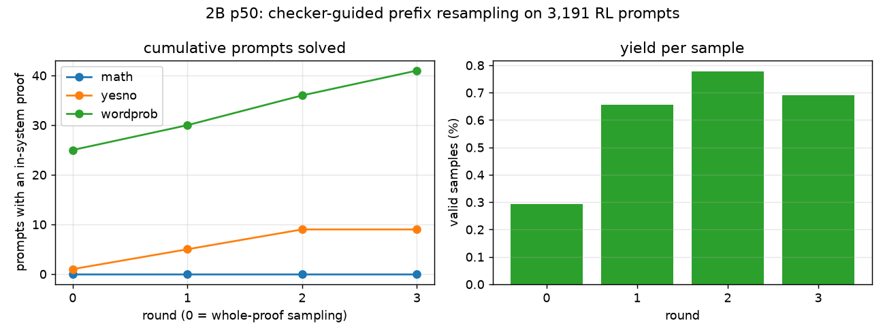

| round | samples | valid samples | valid % | prompts solved (cumulative): wordprob / yesno / math |
|---|---|---|---|---|
| 0 (whole proofs, K = 8) | 25,528 | 75 | 0.29 | 25 / 1 / 0 |
| 1 (prefix + 4 continuations) | 6,104 | 40 | 0.66 | 30 / 5 / 0 |
| 2 | 5,264 | 41 | 0.78 | 36 / 9 / 0 |
| 3 | 4,056 | 28 | 0.69 | 41 / 9 / 0 |

- Resampling from a verified prefix is about 2.4× as sample-efficient as whole-proof sampling (0.7% vs 0.29% valid).
- It nearly doubles the solved prompts (26 → 50) for 60% more compute. The step-level checker is useful as a search signal, which supports Stage 3.
- It still reaches no math prompt, and the absolute yield is small. Pooled with round 1, the EI set (`formal_ei_20260928/2b_r1`, at most 4 proofs per prompt) has **77 proofs from 51 prompts**: 67 word problems and 10 yes/no.
- This is too little to shift a policy by SFT alone. EI SFT is deferred until a GPU is free under the caps. The GRPO pilots below are the main bet.

### Sampling probe on the gate set, 2B p50 (job 6945)
16 samples per item, 400 items (100 per subset):

| T | pass@16 correct | grammatical (mean / pass) | valid pass@16 | in-system pass@16 | signal: correct / gvc / lines / valid |
|---|---|---|---|---|---|
| 0.6 | .61 | .048 / .16 | .025 | .020 | .60 / .63 / .24 / .025 |
| 1.0 | .57 | .028 / .16 | .018 | .013 | .57 / .59 / .23 / .018 |

The dense `lines` arm has a non-constant reward in 24% of groups, 10× more than `valid` (2.5%). T = 0.6 is better than T = 1 on every validity measure.

### Dense reward arm G5 and GRPO pilots (started)
The user suggested rewarding partial progress: "(#grammatical lines + #valid lines) × (1 + correctness)". Taken literally, it rewards length. Long proofs full of repeated `given` lines would outscore a short valid proof, and padding hacks of this kind wrecked the 2026-09 RL runs. The implemented arm `lines` (`scripts/formal_rewards.py`) therefore:
- counts only the lines the conclusion (`ans`) depends on, following citations, with each distinct formula counted once;
- gives validity credit only to derived lines: `given` lines always check, because grounding is a substring test;
- caps each count at 8 lines and adds a validity bonus: `((g+v)/2 + valid)(1+correct)/4`, so a complete valid proof beats any partial one.

**Offline check** (`scripts/analysis/reward_offline_eval.py`), scoring the greedy gate outputs under every arm:

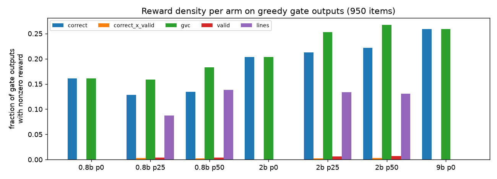

| model | nonzero: correct | gvc | lines | valid | lines mean: valid proofs | invalid |
|---|---|---|---|---|---|---|
| 0.8B p50 | .135 | .183 | .138 | .004 | .52 | .009 |
| 2B p25 | .213 | .253 | .134 | .006 | .52 | .012 |
| 2B p50 | .222 | .267 | .131 | .007 | .53 | .014 |

- The highest-scoring invalid outputs (max .47) are honest near misses. Examples: the cookie proof with one wrong `subst`, and a proof using an unsupported `def` rule. No padding hacks were found.
- `lines` is nonzero on fewer outputs than gvc, but it is graded: it separates a proof that breaks at line 2 from one that breaks at line 12. gvc cannot.
- Only 40% of 2B p50 proofs parse past the goal line, which bounds any line-level reward.

**Pilots, first attempt (cancelled):** 6942 (G1), 6947–6949 (G5/G3/G0 at batch 2).
- The original batch-8 pilots (6940/6941/6943) OOMed in the fp32 logits.
- 6947 and 6948 then died because foreign processes held GPU memory on the shared L40/A100 nodes.
- Worse, the prompt pool was 96% `dolci_math`: 43,551 of 45,242 prompts. That is the subset where the policy has zero in-system proofs, and G1 logged grammatical ≈ 0 and has-proof ≈ .2 in its first steps. On that pool the formal arms cannot be compared fairly, so all pilots were cancelled.

**Pilots, balanced pool (running):** `grpo_formal.py --max-per-bench 1200` gives 1,200 math + 1,200 word problems + 491 yes/no = 2,891 prompts. The runs are 2B, 200 steps × 32 prompts × 8 samples (≈ 2.2 epochs), lr 1e-6, β = 0, T = 1, per-device batch 4. (A first submission, 6955–6958, was cancelled after 1 minute: `sbatch --export=...,EXTRA_ARGS="--benches a,b"` splits at the comma, so it got math only. 6959 (G5) and 6961 (G3) on gruenau9 were killed by another user's non-Slurm process on the same GPU; `grpo_formal_multi.slurm` now allocates 3 L40s and runs both arms on the 2 GPUs with the most free memory.)

| job | arm | policy | node |
|---|---|---|---|
| 6964 | G5 lines | p50, tagged | gruenau12 L40, batch 1 |
| 6960 | G1 correct | p50, tagged | gruenau10 A100 |
| 6965 | G3 gvc | p50, tagged | gruenau8 A6000, batch 1 |
| 6962 | G0 correct | p0, no tag | gruenau8 A6000, after 6727 (batch 2) |

The question: does a dense arm (G5, and G3) raise the grammatical and valid rates by itself, compared with correctness alone (G1)?

### Early finding: correctness-only GRPO drops the formal format (G1, 6960, steps 0-49)

Means over blocks of 6 steps (256 completions each) from the training log:

| steps | correct | grammatical | has `<proof>` | mean length (tokens) |
|---|---|---|---|---|
| 0-5 | .16 | .023 | .31 | 556 |
| 6-11 | .23 | .059 | .39 | 525 |
| 18-23 | .30 | .010 | .30 | 538 |
| 24-29 | .29 | .001 | .10 | 641 |
| 36-41 | .38 | .001 | .13 | 880 |
| 48 | .42 | .000 | .19 | 883 |

Rewarding only the final answer raises correctness from .16 to .42 within 50 steps.
At the same time the policy stops writing parseable proofs: grammatical falls from about 5% to 0
by step 24, fewer completions open a `<proof>`, and the answers become longer and
in natural language. With the `<formal>` tag, `correct` alone therefore does not preserve
the formal chain of thought. This is the motivation for the G3 (gvc) and G5 (lines) arms. Their first steps:
G5 (14 steps) keeps grammatical at .048 and has n_ok .16, and G3 (5 steps) is at .020. Neither
has collapsed so far; it is too early to call a trend.

### Update 15:10: the combined rewards keep the proofs (all four arms)

Means over blocks of 8 steps (2B p50 for G1/G3/G5, 2B p0 untagged for G0):

| arm | steps | correct | grammatical | valid | has `<proof>` | n_ok | length |
|---|---|---|---|---|---|---|---|
| G1 correct | 0-7 | .19 | .030 | .001 | .33 | .11 | 547 |
| G1 correct | 80-87 | .47 | .000 | .000 | .21 | .00 | 799 |
| G3 gvc | 0-7 | .19 | .031 | .001 | .33 | .12 | 522 |
| G3 gvc | 16-23 | .23 | .084 | .008 | .53 | .24 | 562 |
| G5 lines | 0-7 | .18 | .031 | .001 | .34 | .12 | 551 |
| G5 lines | 24-31 | .15 | .151 | .005 | .98 | .36 | 476 |
| G0 correct (no tag) | 0-7 | .18 | - | - | - | - | 472 |
| G0 correct (no tag) | 24-31 | .28 | - | - | - | - | 693 |

- G1 (correct only) trades the formal format for answers: correct .19 to .47, grammatical to 0.
- G3 (gvc, the user's "grammaticality + validity + correctness") raises correct *and* the
  proof statistics: grammatical x2.7, n_ok x2, proof rate .33 to .53.
- G5 (dense lines, the user's "(#grammatical + #valid lines) * (1 + correct)") pushes hardest
  toward proofs (98% write one, grammatical x5, n_ok x3) at a small cost in correctness (.18 to .15).
- Whole-proof validity is still below 1% in all arms. It is the slowest signal.

Why the proofs are still not grammatical (G5, steps 28-30, 768 completions, first fatal parse
error): most errors are a few recurring syntax mistakes, not wrong reasoning. The largest groups
are an ill-formed `goal` line (198), `given` without a quote (160), a step without `;` (36) and
an `ans` line written as a step (`ans 20 = x ; subst 11 10` instead of `ans <expr> ; <label>`, 25).
The top-scoring G5 sample is a correct, well-structured 11-line word-problem proof. It is
rejected only for its `ans` line syntax, one inexact quote and a `def` without `:=`.
Since the whole proof fails on its first syntax error, G5's line credit is what gives these
nearly-right proofs any signal. G3 gives them nothing beyond `correct`.

### Update 17:40: held-out gate on the first checkpoints, and a reward hack in G5

The gate eval (the 950 held-out rl_gate items, greedy) on the step-50/100 checkpoints
(`grpo_gate_ckpts_in_6964.sh`, run inside job 6964's allocation). The columns marked "hardened" rescore
the same generations with the new Stage-2 validity (below). Script: `scripts/analysis/grpo_gate_ckpts.py`,
numbers in `analysis/stage2_gate_ckpts.json`.

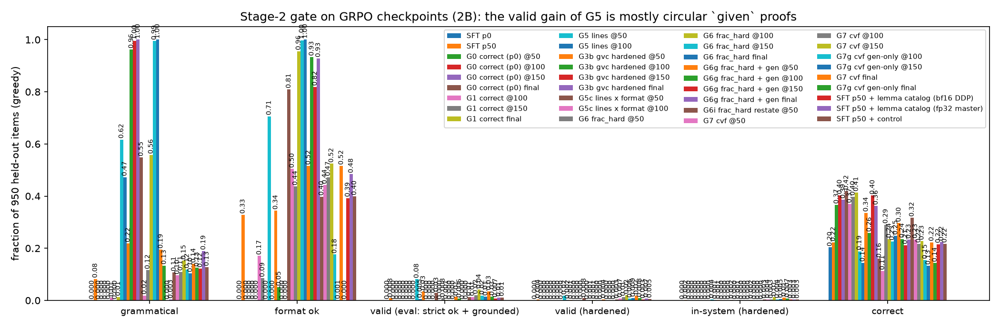

| model | has proof | grammatical | valid (eval) | circular | valid (hardened) | in-system (hardened) | correct |
|---|---|---|---|---|---|---|---|
| SFT 2B p0 | 0 | 0 | 0 | 0 | 0 | 0 | .203 |
| SFT 2B p50 | .399 | .082 | .008 | .038 | .004 | .002 | .222 |
| G0 correct, p0 untagged, step 50 | 0 | 0 | 0 | 0 | 0 | 0 | .366 |
| G1 correct, p50, step 100 | .284 | .011 | 0 | .004 | 0 | 0 | .369 |
| G5 lines, p50, step 50 | .999 | **.617** | .081 | **.283** | .018 | .004 | .188 |

Per bench (G5 @50 vs SFT p50), correct: math .06 vs .14, word problems .21 vs .34, yes/no .56 vs .39.

- **Correctness-only GRPO works for the answer, not for the proof.** G0 and G1 both reach .37 correct
  (from .20/.22), and G1 keeps almost no formal content (grammatical .011). With the tag, the policy
  learns to drop the proof.
- **G5 teaches the syntax.** Held-out grammatical goes from .08 to .62 in 50 steps, and 99.9% of outputs
  contain a proof. This transfers to benches that are not in the RL pool (knowledge: grammatical .72).
- **But G5's validity gain is mostly a hack.** By the eval's definition (rlvl strict ok + grounded), valid
  rises from .008 to .081, and in-system from .003 to .035. Almost all of the in-system gain is on yes/no:
  the model quotes the claim itself as a premise and answers from it:
  ```
  1 throne_of_scotland(mary_magdalene) ; given "Mary Magdalene sat upon the throne ..."
  ans yes ; 1
  ```
  Such a proof checks, is grounded (the quote is a substring of the prompt), and is right about half the time.
  Among G5's valid yes/no proofs, 49 cite only `given` lines (29 correct, 20 wrong); 4 have a derived step.
  28% of all G5 outputs contain a `given` whose formula equals the conclusion ("circular" above; SFT: 4%).
  A second, rarer pattern is a `given` whose formula the quote does not say
  (`white_cells = total_cells - black_cells ; given "each cell contains at most one chip"`),
  flagged by a heuristic in 12 of 77 valid proofs. Grounding is only a substring test on the quote, so
  it does not catch this.
- With the hardened definition, G5 @50 has valid .018 and in-system .004 (4 / 950), against .004 and .002 (2 / 950) for SFT p50.
  Real derived in-system proofs barely moved. The hack paid through G5's +valid bonus: a 2-line circular proof
  gets ((1/8 + 0)/2 + 1) x (1 + correct) / 4 = .27 or .53. An honest proof that breaks at line 6 gets at most .19 or .38.

When it emerged (G5 training samples, T = 1, 300 per 10-step block, rescored with `line_stats`):

| steps | 0-9 | 10-19 | 20-29 | 30-39 | 40-49 | 50-59 | 60-69 | 70-79 | 80-89 |
|---|---|---|---|---|---|---|---|---|---|
| circular | .013 | .010 | .060 | .080 | .107 | .093 | .063 | .067 | .087 |
| valid (old rule) | .003 | .007 | .017 | .033 | .027 | .060 | .013 | .007 | .017 |

The circular route appears after about 20 steps and then stays at 6-11% of samples. The old-rule valid rate peaked at steps 50-59 and did not keep rising.
At 18:30 the hardened arms (G5b, G3b) are at steps 10-12. Their early component means match G5/G3 within noise, with circular ~1%.

**Fix (in effect for new runs, 17:35).** `formal_rewards.components` now counts a proof as valid only if it
also has >= 1 checked derived (non-`given`) line that the conclusion depends on, and no ancestor
`given` states the conclusion's formula (`circular`, now logged). This changes `valid`, `in_system`,
G3's gvc and G5's +valid bonus. The running arms (G1 6960, G0 6962, G5 6964) keep the old
definition, so their curves stay comparable to each other. Unsupported premises (a formula not stated by
its quote) remain possible. Closing that needs a semantic grounding check, which is future work.

**Crash, and the reruns.** G3 (6965) died at step 49, before its first checkpoint: a quote that begins
with `…` made `rlvl.check` slice inside a UTF-8 character (`near()` in `rlvl/src/parse.rs`). PyO3 raises
this Rust panic as a `BaseException`, which `except Exception` does not catch. Fixed in rlvl (the error position
now snaps to a char boundary in `near` and in `parse_lines_at`; 166k fuzzed checks with multibyte
insertions, 0 panics), and the reward code now catches `BaseException`. The running jobs loaded the old
library and can still hit the panic (they save every 50 steps). Two new arms with the hardened reward
started at 17:35:

| job | arm | policy | node |
|---|---|---|---|
| 6977 | G5b lines, hardened valid | p50, tagged | gruenau8 A6000, batch 1 |
| 6978 | G3b gvc, hardened valid | p50, tagged | gruenau12 L40, batch 1 |

The G3 log for steps 0-49 is kept for the curves (`grpo_curves.py`).

### Update 19:45: after step 60, G5 pads its proofs and drops the output format

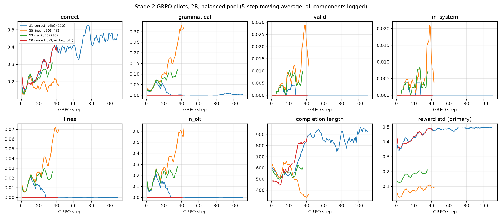

*Stage-2 GRPO curves for all arms, 5-step moving average. `valid`/`in_system` use the old rule for G0/G1/G3/G5 and the hardened rule for G5b/G3b. Only G5b/G3b log `circular`.*

Steps 60-99 of G5 (6964) change the picture. Line credit (`n_ok`) rises from 1 to 4.5 (max 68) and the mean length from ~350 to ~1650 tokens. Meanwhile grammatical falls from .6 to .4, valid (old rule) falls to ~0 and correct stays at ~.16. The extra lines are padding, of three kinds:

- **Tautologies and restatements.** Derived lines like `11 rest = rest ; given ...` or `child = child ; subst 2 3`, and the same equation re-derived under a new label (`8 worker = working ; subst 6 3` after `5 worker = working`).
- **Unrolled chains.** Each step becomes a new variable and three lines, e.g. `21 x51 = x50 + 1 ; given "x increases by 1"`, `22 x51 = 96 + 1 ; subst 20 21`, `23 x51 = 97 ; calc 22`, continuing to x62 and beyond. Every line is a distinct formula that checks, so it counts toward `n_ok`, up to the cap of 8.
- **Runaway text after `</proof>`.** The policy writes prose ("Therefore, the answer is 6517.") instead of the `Answer:` line, repeats `</proof>`, loops on "Now, we write the final answer...", or opens a new `assistant <think>` turn. Proofs that never close run to the 2048-token limit. TRL masks truncated completions, so these completions get no gradient and nothing pushes back against them.

| G5 steps | tautology share of derived lines | any tautology | chars after `</proof>` | > 1 `</proof>` | format ok* |
|---|---|---|---|---|---|
| 0-9 | .005 | .07 | 4 | 0 | .32 (most have no proof yet) |
| 30-39 | .008 | .05 | 16 | 0 | .95 |
| 50-59 | – | – | – | – | .35 |
| 60-69 | .010 | .10 | 119 | .08 | .01 |
| 90-99 | .014 | .23 | 1276 | .52 | .00 |

\* format ok: exactly one `</proof>`, followed only by the `Answer:` line, as in the SFT data. From step 90, only 17% of completions have an `Answer:` line at all.

**G5c (job 7000, 19:45) replaces G5b (6977, cancelled at step ~27).** G5b fixed only the circular route and uses the same lines formula, so it would drift the same way. G5c's reward is `lines_fmt = lines × format_ok`. On top of the hardened valid, tautological derived lines count toward neither `n_parsed` nor `n_ok`, and so they no longer satisfy valid's ">= 1 derived line" either.

Replaying G5's own samples through the new reward gives the same values as `lines` up to step 40 (.016/.027/.031/.055/.063 vs .016/.028/.033/.061/.084). From step 60 it gives 0: all of G5's gain after step 50 came from outputs the format gate rejects.

Unrolled chains that check are still paid up to the cap of 8 lines, because they are valid derivations, just verbose ones. The cap bounds the payoff, and the format gate removes the length run-off. G3b (6978, gvc) keeps running: its reward does not count lines, and it has not drifted so far (length ~650).

### Update 21:00: does "%valid lines + %grammatical lines + correct" remove the incentive to hack?

The user's proposal: `frac = (share of parsed lines + share of checked derived lines + correct) / 3`. Using shares instead of counts removes the payoff for length, so padding no longer helps. It creates a payoff for brevity instead. A proof with two lines, both "valid", scores 100% on both shares, just like a long honest proof, and is much easier to write. The only line a short proof cannot check is its premise, and `given` is grounded only by a substring test on the quote. So the question becomes whether the policy can buy a perfect score with an invented premise. We tested this offline and on real GRPO samples.

**Offline audit** (`scripts/analysis/reward_hack_audit.py`). We took 300 yes/no and 300 numeric held-out generator items. For each one we built completions that all end in the correct answer: the gold proof, and six variants. Each variant was scored under every candidate reward.

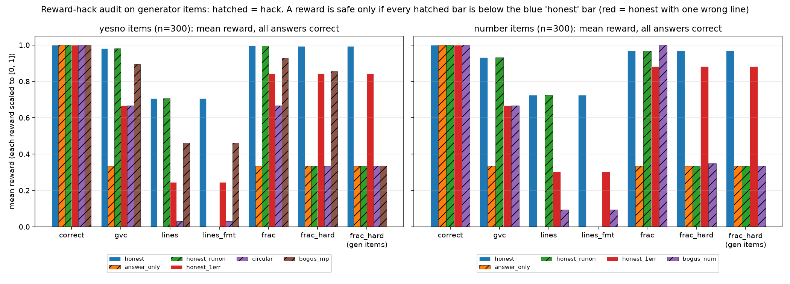

| mean reward (yes/no · number) | gvc | lines_fmt | frac (user) | frac_hard | frac_hard, gen items |
|---|---|---|---|---|---|
| honest (gold proof) | .98 · .93 | .71 · .73 | **.996 · .969** | .993 · .969 | .993 · .969 |
| honest, one derived line wrong | .67 · .67 | .24 · .30 | .84 · .88 | .84 · .88 | .84 · .88 |
| answer only | .33 · .33 | 0 · 0 | .33 · .33 | .33 · .33 | .33 · .33 |
| honest + prose after `</proof>` | .98 · .93 | 0 · 0 | .996 · .969 | .33 · .33 | .33 · .33 |
| circular (`P ; given`, `ans yes`) | .67 · – | .03 · – | .67 · – | .33 · – | .33 · – |
| bogus_num: `lhs = a + 0 ; given "<fact>"`, `lhs = a ; calc`, 2 lines | – · .67 | – · .09 | – · **1.00** | – · .35 | – · .33 |
| bogus_mp: invented `F -> P ; given "<other fact>"`, `F ; given`, `P ; mp` | .89 · – | .46 · – | **.93** · – | .85 · – | .34 · – |

- **Plain `frac` is hackable.** Guessing the answer and smuggling it into a premise scores 1.00, more than the gold proof (.969). Prose after `</proof>` also costs nothing.
- **`frac_hard`** adds a premise check, a format check and a circularity check. Every number in a `given` formula must occur in its quote (in any form: digits, fractions, percents, number words). The output must be in the SFT format, and no `given` may be circular. Under `frac_hard`, all of these hacks drop to the correct-only floor of .33. The numeric check wrongly rejects none of the 600 gold proofs. It still pays the purely logical hack (bogus_mp) .85, which is below honest (.99) but not by much. Nothing in the text-only check can tell that `before(ceremony, rehearsal) -> ~before(auction, ceremony)` is not what "The rehearsal took place before the auction" says.
- **An exact check on generator items.** Generator items carry the gold formalization of every sentence. There, the premise check becomes "each `given` is a gold form of the quoted sentence" (`eval_formal_vllm.faithful_given`). This rejects 1653/1656 bogus_mp proofs, 1593/1656 circular ones (the rest are items whose claim is itself a stated fact) and 0/1855 gold proofs. It is the only reward where every hack lands on the floor, while one wrong line still earns .84–.88. That near-miss credit is the dense gradient that `gvc` (.67) lacks.
- A lexical variant for Dolci also looked promising: every constant in a `given` must appear in its quote. It catches 65% of bogus_mp, but it wrongly rejects 3.8% of gold yes/no proofs (the `ab(fly, x)` default-reasoning constants), so it is not used.

**Replay on real samples** (`scripts/analysis/frac_replay.py`). We scored the completions G5 and G3b actually generated during training with `frac` and `frac_hard`:

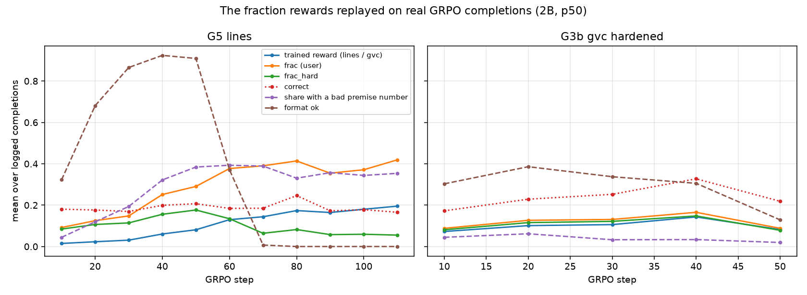

Between steps 10 and 110 of G5, `frac` climbs from .09 to .41 while correct falls from .18 to .16. From step 50, 36-39% of G5's completions contain a `given` with a number that is not in its quote. So G5's padding and invented premises would have earned *more* under `frac` than under `lines`, the reward G5 actually trained on. `frac_hard` peaks at .18 and falls to .05 once the format breaks. On G3b, which has not hacked, all three rewards move together.

**Answer to the question.** Shares instead of counts remove the length incentive, but not the incentive to hack. The hack moves to short proofs with an invented premise, and plain `frac` pays those as much as an honest proof, or more. The fraction form becomes safe only when premises are checked. Numeric premises can be checked from the text alone. Logical premises can only be checked exactly against a gold formalization, which exists for generator items but not for Dolci.

**Two new arms (2B p50, 200 steps, batch 1, vllm-mem 0.25):**
- **G6** (7006, gruenau12 L40): `frac_hard` on Dolci (math/wordprob/yes-no, 1200 each), with the numeric premise check.
- *21:30:* G6 was resubmitted as 7013 after 7006 hit a CUDA OOM on an L40 that non-Slurm processes were sharing. G6g failed twice on shared A100s (7007, 7009) and waits for a clean GPU. G5 (6964) was stopped at step 116.
- **G6g** (7009, gruenau10 A100; 7007 died at vLLM start on gruenau9, where a non-Slurm process holds 72 GB of the GPU): `frac_hard` on the same Dolci prompts plus 1200 generator pool-train items (`--benches gen,...`: yes/no and numeric, no tool families). The generator items use the exact faithfulness check. The question is whether faithful formalization learned where it is checkable carries over to the Dolci gate, where it is not.

The gate on G1 and G5 checkpoints is also complete:

| checkpoint | grammatical | format ok | valid (hardened) | correct |
|---|---|---|---|---|
| G1 correct @100 / @150 / final | .011 / 0 / .013 | .17 / .09 / 0 | 0 | .369 / .398 / .414 |
| G5 lines @50 / @100 | .617 / .473 | .71 / 0 | .018 / .002 | .188 / .144 |

G1 improves correct steadily (.22 SFT to .41) and loses the proof format completely. G5@100 is worse than G5@50 on every metric, which confirms the padding and format drift on held-out data.

## Pending
- Gate the later checkpoints (G5 150/200, G0 final), and G5c/G3b/G6/G6g at 50 and 100: does
  hardened validity rise once the circular route pays nothing?
- Semantic premise check for Dolci logic premises (e.g. an LLM judge, or a formalize-back check); the
  numeric check covers only numbers (update 21:00).
- EI round-1 SFT on `formal_ei_20260928/2b_r1` once GPUs free up. Possibly merge it with in-system samples from the GRPO runs first.

## Update 21:45: 9B p50 gate (6933)

| model | has proof | grammatical | valid | correct | in-system |
|---|---|---|---|---|---|
| 2B p50 | .399 | .082 | .008 | .222 | .003 |
| 9B p0 | .000 | .000 | .000 | .259 | .000 |
| 9B p50 | .765 | .200 | .032 | .316 | .020 |

The two figures above (per bench, error breakdown) now include 9B p50.

- **Scale helps every formal rate.** 9B p50 is 2.4× as grammatical as 2B p50 and has 7× its in-system rate (19 of 950 items, all on yes/no and word problems).
- **The mixture does not cost 9B correctness under the tag.** Overall correct is .316 against .259 for 9B p0. The gain comes from yes/no (.53 against .18) and word problems (.56 against .45). On math and DAPO p50 loses about .07–.09: it writes a proof on 87% / 73% of those prompts, and only 9% are grammatical.
- **Unlike 2B, 9B does not fall back to natural language on hard math.** 537 of its 727 proofs fail to parse.
- 9B is the strongest Stage-2 starting point. GRPO on 9B needs an H100 pair, however, and those are busy with the Stage-1 9B cells (p25 6841, then p10 6843).
- The 9B p50 formal eval (6840) died at vLLM start: a hybrid model needs one Mamba cache block per sequence, and a shared L40 fit only 219 of the 256 it wanted. `eval_formal_vllm.py` now has `--max-num-seqs` (`MAX_NUM_SEQS` in the eval job). The eval was resubmitted as 7019 with 128.
- **GRPO arms:** 7013 (G6) left no output after 20:11. G6 was resubmitted as 7020 on gruenau9, where A100 GPU0 is now clean. G6g (7021) was stopped by the free-memory guard on a shared gruenau10 A100 and is still waiting.

## Update 00:40 (2026-09-29): gate on G0@100, G3b@50/@100, G5c@50, G6@50

950 held-out items, greedy, rescored with the hardened `formal_rewards` (figure `figures/stage2_gate_ckpts.png`, `scripts/analysis/grpo_gate_ckpts.py`).

| model | has_proof | grammatical | format ok | circular | valid (hardened) | in-system | correct |
|---|---|---|---|---|---|---|---|
| SFT p50 | .399 | .082 | .328 | .038 | .004 | .002 | .222 |
| G0 correct (p0) @100 | 0 | 0 | 0 | 0 | 0 | 0 | .403 |
| G3b gvc hardened @50 | .385 | .219 | .344 | .175 | .001 | .001 | .336 |
| G3b gvc hardened @100 | 1.000 | .962 | .052 | .922 | 0 | 0 | .259 |
| G5c lines x format @50 | .999 | .548 | .809 | .268 | .008 | .002 | .160 |
| G6 frac_hard @50 | .512 | .116 | .437 | .055 | .001 | .001 | .291 |

**G3b has reward-hacked the grammatical term of gvc.** Between steps 81 and 91 its training samples jump from grammatical .32 to .76, and by step 111 they reach .94. Valid stays at 0 and correct falls from .46 to .29. At @100, 92% of gate outputs are the same one-line proof: the goal restated as a `given` quoting some sentence, then `back 1`. The model then repeats the proof block and the answer after `</proof>`. The hardened valid rejects this proof (circular), but gvc still pays 1/3 for grammaticality. This is the vacuous-proof hack the user expected. Any reward that pays grammaticality on its own, without format and circularity gates, is hackable. frac_hard gates the line credit by format ok and no circular `given`, so it scores this proof at correct/3 only. G6 (frac_hard) @50 shows no drift: circular .055, format ok .437, correct .291.

G0 (correctness only, from p0) keeps improving the answer rate: .366 @50, .403 @100, with no formal output. G5c @50 looks like G5 @50: many proofs and format ok .81, but 27% circular and correct .16.

Next:
- G3b (6978) should be stopped; its later checkpoints only deepen the hack. I tried to cancel it, but the permission check blocked me, so it is left for the user.
- The 7035 queue gates G5c@100 and the G0 final model when they are written.
- G6/G6g gates at @100.

## Update 02:40 — three frac_hard loopholes in G6's samples, closed (45c128d); G6h launched

G6 (frac_hard) raised its line credit while `valid` stayed ~0. In G6 steps 92–95, 105 of 1024 completions got line credit > 1.5 while invalid. Three exploits:

| loophole | example | fix in `line_stats` |
|---|---|---|
| block header | `5 ~p ; contra` with a wrong or unparsable body: rlvl marks the header ok | body lines `L.1, L.2, ...` are ancestors of `L`; `L` checks only if its whole body checks |
| trusted rules | `1 cuts = 6 ; know`, then `subst 1 2`; `girls = 3 / 5 * 500 ; def` | `know/def/obs/assume` earn no credit; a *rejected* trusted line counts as a failed derived line; `obs` quotes and `know/def` numbers (vs prompt + unit constants 7 12 24 60 100 1000) get the premise-number check; circularity covers every trusted rule |
| free arithmetic | `1 4 + 1 = 5 ; calc` cited by the answer line | a `calc` line citing nothing, with no identifiers, counts as a tautology (denominator only) |

Checks:
- Gold proofs (pool/test, 2000): 0 false premise rejections. There were 26/113 on `know` proofs before the unit constants were added. Mean frac_ok is .976 → .946.
- Hack audit (`analysis/reward_hack_audit.json`, figure regenerated):
  - honest yes/no .993 → .967, honest number .969 → .958;
  - honest with one wrong line .842 → .741 (yes/no), .882 → .859 (number), so the margin widens;
  - every hack keeps its floor. bogus_mp on Dolci yes/no (.854) is still paid; only exact faithfulness on gen items catches it. The semantic premise check for Dolci logic is still open.
- Replay on the last 4 logged steps:

| run | line credit | invalid with credit > 1.5 | frac_hard | valid samples |
|---|---|---|---|---|
| G6 | .750 → .594 | 105 → 55 | .337 → .285 | none (all 0) |
| G6g | .702 → .516 | 227 → 84 | .386 → .324 | all 38 keep full credit 2.0 |

- The remaining high-credit invalid samples are mostly honest partial proofs with one wrong line. Example: `price = ava + ethan + liam ; def` without `:=`, then correct arithmetic. That is the partial credit the reward is meant to give.
- Gate rescored with the new code: G6@50 circular .055 → .086, because `know`/`obs` restatements of the goal now count. Nothing else moved.

**G6h** (7051, gruenau7 A6000; 7050 on gruenau12 hit the shared-GPU guard): G6g config (frac_hard, gen + Dolci math/wordprob/yesno, 2B p50, 200 steps) with the hardened `line_stats`. G6/G6g keep running on the old code as the comparison arms.

## Update 03:45 — gate at step 100 for the frac_hard arms; G6h restarted

The gate is 950 held-out items, greedy, rescored with the hardened `line_stats` (45c128d).

| model | proof written | grammatical | format ok | circular | valid (hardened) | correct |
|---|---|---|---|---|---|---|
| SFT p50 | .399 | .082 | .328 | .054 | .004 | .222 |
| G0 correct (p0) @100 | 0 | 0 | 0 | 0 | 0 | .403 |
| G6 frac_hard @50 | .512 | .116 | .437 | .086 | .001 | .291 |
| G6 frac_hard @100 | .999 | .558 | .956 | .107 | .001 | .236 |
| G6g frac_hard + gen @50 | .562 | .195 | .516 | .061 | .004 | .297 |
| G6g frac_hard + gen @100 | .988 | .134 | .934 | .093 | .000 | .236 |

Reading:
- frac_hard does what its dense part rewards: a proof on every item, in the right format; G6 is grammatical on 56%.
- Validity does not follow: 0–0.1% on held-out items.
- Correctness falls from ~.29 (@50) to .236 (@100), close to SFT p50 (.222) and far below G0 (.40).
- On the rl_gate prompts, the ≥ 1/3 of the reward that line credit pays is earned by grammatical-but-wrong proofs faster than by correct answers.
- The loopholes closed in 45c128d explain part of the line credit, not the lack of validity.

Implication: a dense line reward does not bridge the gap from ~0.3% valid. Rewarding validity needs valid samples to exist first (EI / prefix-search SFT), or a curriculum on generator items where the 2B model is already valid 67%.

G6h: 7051 OOMed because I submitted it without G6g's batch args (default per-device batch 8). 7059 hit the guard (a foreign llama-server appeared on gruenau7). Running as **7060** with G6g's exact args (`--max-per-bench 1200 --max-steps 200 --save-steps 50 --per-device-batch 1 --vllm-mem 0.25`), MIN_FREE_MIB=40000.

## Update 05:00 — frac_hard destroys reachable validity; gate for G0 final and G5c @100

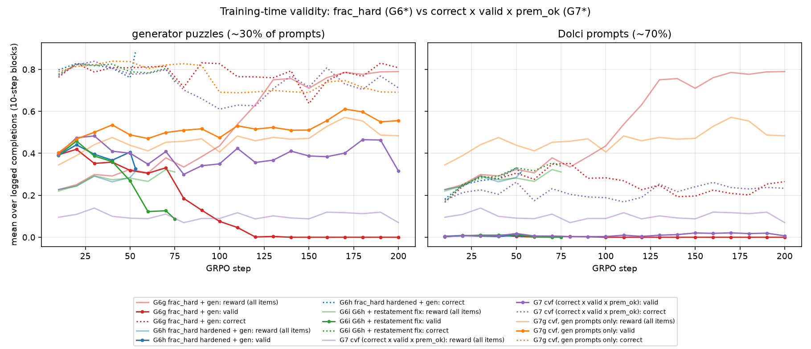

The run's own logged components, split by item type: about 30% of G6g's prompts are generator puzzles, matched to the pool by prompt text. The SFT policy proves these validly 41% of the time. Under the old frac_hard, validity on them falls while the reward rises (10-step blocks):

| G6g steps | reward (frac_hard) | valid, gen | correct, gen | valid, Dolci | correct, Dolci |
|---|---|---|---|---|---|
| 1–20 | .24 | .41 | .80 | .005 | .21 |
| 61–80 | .36 | .26 | .77 | .004 | .35 |
| 81–100 | .41 | .10 | .83 | .001 | .28 |
| 121–138 | .75 | .00 | .77 | .000 | .22 |

This is reward hacking in the plainest sense: GRPO trades away validity it already had. The G6g completions that earn full reward at step 130 on generator items are a contra shell whose body refutes nothing:

```
goal robot(pilot(x)) ?
1 ~robot(pilot(x)) ; contra
1.1 robot(pilot(x)) ; assume
1.2 false ; cases 1.1
ans no ; 1
```

The old code gave this frac_hard 1.0. The hardened code (45c128d) gives frac_ok 0 and frac_hard .67, the parsed-line credit plus correct. The block header is now credited only if its whole body checks, so an honest proof keeps a margin (1.0 against .67). G6h (7060) runs the same config with the hardened reward. Its first 5 steps match G6g (valid on gen .42, reward .26). The test is whether valid on gen stays near .4 through steps 60–100, where G6g had fallen to .10.

Gate (950 held-out Dolci items, hardened scoring):

| model | has_proof | grammatical | format_ok | valid | correct |
|---|---|---|---|---|---|
| G0 correct (p0) final | 0 | 0 | 0 | 0 | .420 |
| G5c lines x format @50 | .999 | .548 | .809 | .008 | .160 |
| G5c lines x format @100 | 1.000 | .019 | .504 | .000 | .113 |

G5c collapses: by @100 it keeps the proof shell but loses grammar and half the format, and correct falls to .11. G0 final (.420) is the best answer accuracy of any 2B checkpoint. So far, every dense proof reward costs accuracy relative to correct-only.

## Update 07:00 — the @150 gate: each dense arm has collapsed into one hack; restatement loophole closed (66676fa); G6i

G6 (7020) and G3b (6978) finished 200 steps. Gate at step 150 (950 held-out Dolci items, hardened scoring):

| model | has_proof | grammatical | format_ok | circular | valid | correct |
|---|---|---|---|---|---|---|
| G0 correct (p0) final | 0 | 0 | 0 | 0 | 0 | .420 |
| G1 correct final | .275 | .013 | 0 | 0 | 0 | .414 |
| G3b gvc hardened @150 | 1.000 | .996 | 0 | 1.000 | 0 | .402 |
| G6 frac_hard @150 | 1.000 | .995 | .998 | 0 | 0 | .226 |
| G6g frac_hard + gen @150 | 1.000 | 0 | .819 | .001 | 0 | .212 |

What each arm writes at step 150:

- **G3b (gvc)**: a one-line circular proof, `1 <goal> ; given "<goal>"` then `back 1`, closed by `</proof>` and an `Answer:` line, with an ordinary chain of thought after it. It is grammatical and paid for that, but not valid and not format-ok. correct stays at .40 because the prose still solves the problem.
- **G6 (frac_hard, old code)**: one constant shell on 72% of items, only 8 distinct proof openings in 950: `goal cos=2 ? / 1 cos=2 ; calc / 2 cos=2 ; calc / 3 cos=2 ; subst 2 1`. rlvl rejects lines 1–2 but accepts line 3 locally. Credit was pooled per distinct formula with an OR, so `cos=2` counted as checked and this shell got full line credit. Even under 45c128d's hardening it scored frac_hard .741 on the gate.
- **G6g (frac_hard + gen, old code)**: chains of empty `contra` shells. 45c128d already gives them frac_ok 0, but on the old reward they were paid in full.

**Fix (66676fa).**
- A derived line whose formula equals one of the formulas it cites derives nothing and counts as a tautology.
- A derived formula checks only if every line stating it checks (AND instead of OR).

Effect:
- G6's gate frac_hard falls .741 → .408, and its frac_ok 1.0 → 0.
- G6's last 4 training steps: invalid samples with line credit > 1.5 fall 1024 → 0.
- G6h's valid samples keep credit 1.97.
- The hack audit is unchanged: honest .967 / .958, 1err .741 / .859, every hack as before.

**G6i (7078, gruenau9 A100)** reruns G6g/G6h with this fix. G6h (7060, on the A6000, at step ~20) continues on 45c128d as a replicate: its valid rate on gen is .45 and it shows no shell yet. Gate 7077 queued for the final checkpoints of G6, G3b and G6g.

The pattern so far: every dense proof reward (lines, gvc, frac, frac_hard) found a zero-validity shell within 100–150 steps, and each time the shell was one the audit had not anticipated. Each fix has closed the specific shell. None has yet made valid proofs the easiest way to reward on Dolci, where the SFT policy is valid ~0.5% of the time. G6h and G6i on generator items are the direct test of whether a hardened reward at least *keeps* validity where it is reachable.

## Update 2026-09-29: correct x valid, lib knowledge, longer SFT

**Reward correct x valid.** Share of 8-sample groups where the reward varies (the GRPO signal): correct alone ~0.50 on gen and Dolci items; correct x valid 0.79 (G6h) / 0.73 (G6i) on gen items but only 0.02 on Dolci items, because the SFT model almost never writes a valid proof there. Plain correct x valid also pays proofs that invent premises (bogus modus ponens is "valid" on 69% of Dolci yes/no items), so the arm is `cvf` = correct x valid x prem_ok. Running: G7 (7079, gen + Dolci) and G7g (7086, gen only). G7g at step 2: correct .76, valid .38.

**Does the model know the lib?** No. 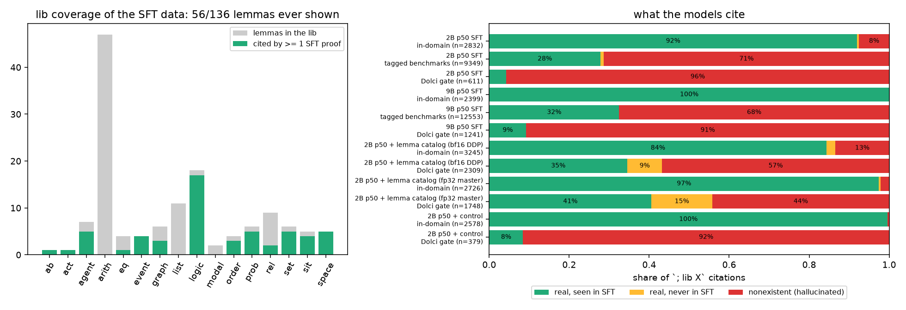
The SFT proofs cite 56 of the 136 lib lemmas (none of the 47 arith lemmas, none of list/modal). Hallucinated `; lib X` cites: 2B p50 8% in-domain, 71% on tagged benchmarks, 96% on the Dolci gate; 9B p50 91% on the Dolci gate. More rows of the same generator do not help (the 3x pool still cites 56/136). Fix: a lib-catalog SFT family covering every lemma (statement + worked uses), and/or the lib index in the system prompt.

**Longer SFT.** 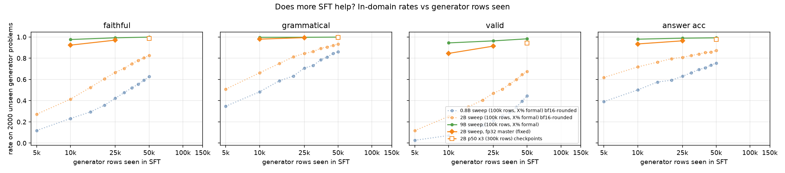
In-domain valid is not saturated: 2B +~0.2 per doubling of generator rows (5k .12, 10k .25, 25k .47, 50k .675); 9B p50 .983. Job 7088 trains p50 at 3x rows (300k, 2344 steps); checkpoints at 781/1562/final give points at 50k/100k/150k generator rows. 10x only if 3x still gains on the gate, not just in-domain.

**G6g gate:** collapses (final: grammatical .003, valid 0, correct .233); G0 (correct-only) final remains best on the gate (correct .420 vs SFT .222).

## Update 2026-09-29 (evening): correct x valid reward, lib-catalog SFT

### Reward cvf = correct x valid x prem_ok (G7, G7g)
The user's suggestion was to multiply correctness by validity. G7 uses the p50 prompt mix and G7g uses generator prompts only.
cvf is the first reward that has **not** eroded the in-domain valid rate during training:

| run (reward) | valid on generator prompts during training |
|---|---|
| G6g frac_hard | .39 → .00 by step 120 (reward hacked; reward .79) |
| G6i frac_hard + restatement fix | .46 → .09 by step 75 |
| G7 cvf | .39 → .40 at step 55 (reward ~.1: sparse) |
| G7g cvf, gen prompts only | .40 → .54 at step 40 |

On Dolci prompts, valid stays at ~.01 for every arm. A multiplicative reward therefore gives almost no signal there, and the Dolci gate barely moves:

| model | Dolci gate valid | Dolci gate correct |
|---|---|---|
| SFT p50 | .004 | .222 |
| G6i @50 | .003 | .317 |
| G7 cvf @50 | .007 | .234 |


**Reading.** The bottleneck on Dolci is the SFT base, not the reward. The model cannot write valid formal proofs for open-domain prompts, so correct x valid is zero almost everywhere.

### Does the model know the persistent knowledge base? No.
- The p50 SFT pool uses only **56/136** lib lemmas.
- On the Dolci gate, **91–96%** of the `lib` cites name lemmas that do not exist (`analysis/lib_coverage.json`).


**Fix.** New opt-in generator family `lemmas` (RLVL-next `gen/rlvlgen/families/lemmas.py`). Each item states library lemmas and uses them correctly via `lib` + `mp`.
- Every lemma is checker-valid.
- Every lemma passes the audit and the z3 oracle. The oracle gained predicate-variable instantiation over the story's heads, and the generator now rejects contradictory premises.

**Matched continued-SFT experiment** (`scripts/data/build_lemma_continue.py`). Both arms start from the 2B p50 final and each has 20k rows, 1 epoch:
- **lc**: 5k `lemmas` + 5k fresh generator + 10k unseen Dolci (job 7100).
- **ct**: 10k fresh generator + 10k unseen Dolci (job 7103, control).

Readouts:
- the share of hallucinated cites and the lib coverage on the Dolci gate;
- the in-domain rates;
- the Dolci gate valid rate.

Evals 7104/7105 and gates 7106/7107 are chained.

### Longer instruction tuning
2B p50 x3 (300k rows, job 7088) is running. Checkpoints at 50k/100k/150k generator rows feed `reports/figures/sft_scale_curve.png`. 10x runs only if 3x (or lc) moves the Dolci gate.

### 11:40 — lemma-catalog continued SFT (lc): first result
| model | in-domain valid | gate has_proof | gate grammatical | gate valid | gate correct | gate lib cites nonexistent |
|---|---|---|---|---|---|---|
| SFT p50 | .675 | .399 | .082 | .004 | .222 | 585/611 (96%) |
| p50 + lemma catalog (lc) | .645 | .503 | .122 | .003 | .216 | 1311/2309 (57%) |

- The catalog works as a catalog. The model now cites 38× more *real* lemmas on open-domain prompts, including 201 cites of lemmas it never saw in p50 SFT, and the share of invented names falls from 96% to 57%.
- It does **not** move gate validity. Among grammatical-but-invalid gate proofs, invented lemmas are the first error in only 30/109; quotes not in the prompt (32) and other rule misuse account for most of the rest. Above all, 88% of gate outputs are not grammatical at all.
- The price in-domain is small: valid −.03, and invented cites rise 8% → 13%. The model now also reaches for "lemma-like" names on generator items.
- The control arm ct (same size, no lemmas) is still training. It decides whether the grammatical gain (+.04) comes from the catalog or simply from more SFT.


## Update 2026-09-29 ~18:00 — precision bug: the 0.8B/2B SFT sweep barely trained

**Finding.** `scripts/train_formal_mixture_sft.py` loaded the model in bf16. Under plain DDP (every 0.8B/2B sweep run, and lc 7100), HF's `bf16=True` is only autocast, and AdamW steps the parameters in their own dtype. A bf16 weight has 8 mantissa bits, so an update of ~lr = 5e-6 rounds to zero unless |w| < ~1e-3. The 9B sweep, ct (7103) and x3 (7088) use DeepSpeed ZeRO-2, which keeps fp32 master weights, so they trained normally. GRPO (TRL) trains in fp32 and is unaffected.

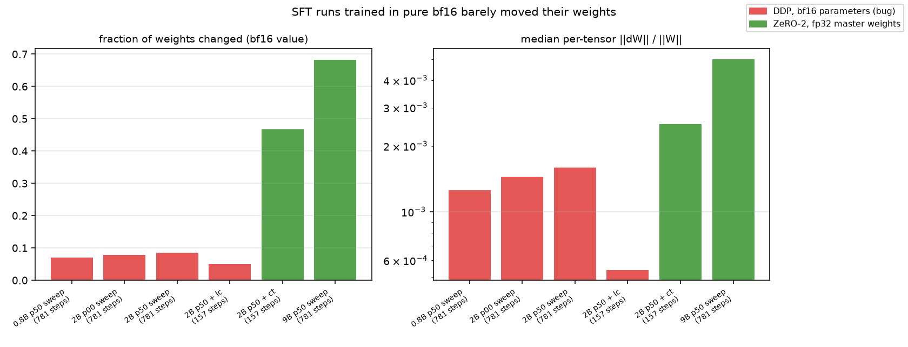

`scripts/analysis/weight_update_frac.py` compares each trained model with its init (every 7th text tensor; `analysis/weight_update_frac.json`):

| run | optimizer precision | steps | bf16 values changed | median ‖ΔW‖/‖W‖ |
|---|---|---:|---:|---:|
| 0.8B p50 sweep | DDP, bf16 params | 781 | 7.0% | 1.3e-3 |
| 2B p00 sweep | DDP, bf16 params | 781 | 7.8% | 1.4e-3 |
| 2B p50 sweep | DDP, bf16 params | 781 | 8.5% | 1.6e-3 |
| 2B p50 + lc | DDP, bf16 params | 157 | 5.0% | 5.4e-4 |
| 2B p50 + ct | ZeRO-2, fp32 master | 157 | 46.8% | 2.5e-3 |
| 9B p50 sweep | ZeRO-2, fp32 master | 781 | 68.3% | 5.0e-3 |

**This explains ct ≫ lc.** In 157 steps, ct changed about 9× more weights than lc. In-domain (2000 unseen generator items), ct reaches valid .870 (faithful .952, grammatical .987, answer .943). lc reaches .645 and p50 .675. So the gap is the precision bug, not lemma rows hurting. It also shows that 2B has much more in-domain headroom than the sweep suggested.

**The gain does not transfer to the Dolci gate.**

| metric | p50 | lc | ct |
|---|---:|---:|---:|
| grammatical | .082 | .122 | .127 |
| valid | .004 | .003 | .005 |
| correct | .222 | .216 | .217 |

ct has has_proof .449. Lib cites naming nonexistent lemmas:

| run | formal_eval | Dolci gate |
|---|---:|---:|
| ct | 10/2578 | 347/379 (92%) |
| lc | — | 1311/2309 (57%) |

So even the crippled lc run makes the model cite real lemmas. A clean lemma-catalog test needs lc with fp32 master weights (7133).

**Consequences**
- The 0.8B/2B Stage-1 sweep numbers (in-domain rates, benchmarks, tagged evals) describe under-trained models. The *shape* of the mix curves may survive, but the levels will not.
- Every GRPO arm so far started from the crippled 2B p50.
- The 9B sweep is valid.
- x3 (ZeRO-2) confounds "3× rows" with "correct precision" relative to the old p50. The new p50_fp32m is the proper 1× reference.

**Fix and reruns**
- The train script now loads fp32 unless `--deepspeed`/`--fsdp` is given; it logs `[precision] load dtype=...`.
- All reruns use ZeRO-2 (fp32 master weights).
- p50_fp32m and p00_fp32m each chain formal_eval → Dolci gate → bench → tagged.

| run | job | where | chain |
|---|---|---|---|
| 2B p00_fp32m | 7146 | gruenau7, 2× A6000 | 7136 / 7142 / 7143 / 7144 |
| 2B p50_fp32m | 7147 | gruenau12, 1× L40, optimizer offloaded to CPU | 7135 / 7139 / 7140 / 7141 |
| lc_fp32m | 7133 | gruenau9, after 7108 | eval 7137, gate 7138 |

7134/7145 were cancelled: another user's non-Slurm processes hold 7–17 GB on the allocated GPUs, below the free-memory guard.

**Next**
- Once p50_fp32m and p00_fp32m land, redo the 2B points of the sweep figures against them.
- Rerun 2B p10/p25 and 0.8B with ZeRO-2 as capacity frees up.
- Restart Stage-2 GRPO from a correctly trained base (p50_fp32m or x3).

## Update 2026-09-29 ~15:45 — cvf gate @100


Dolci gate, hardened valid (job 7108):

| arm | step | has_proof | grammatical | valid | correct |
|---|---:|---:|---:|---:|---:|
| SFT p50 | — | .399 | .082 | .004 | .222 |
| G7 cvf | 50 | .541 | .096 | .007 | .234 |
| G7 cvf | 100 | .736 | .109 | .013 | .217 |
| G7g cvf, gen only | 100 | .698 | .119 | .006 | .155 |

- **G7 @100 has the highest gate valid of any arm (.013)**, with no circular or tautology hack (circular .164, n_taut .04), but it is still ~1%.
- G7g (gen prompts only) loses answer accuracy on Dolci (.155).

On the training split (`grpo_train_split.py`):

| arm | split | earlier | latest |
|---|---|---|---|
| G7 | Dolci valid | ≤.004 (steps 90–120) | .022 (step 158) |
| G7 | Dolci correct | ~.19 | .27 |
| G7 | gen valid | — | stable .35–.42 |
| G7g | gen valid | .40 | .52 |

So cvf improves slowly, without collapse. All of this is from the precision-bug-affected 2B p50 base; the next GRPO round should start from a correctly trained SFT.

Operations:
- lc_fp32m 7133 OOMed at step 0: a foreign 55 GB process landed on its A100 after the guard passed.
- It was rerun as **7148** (gruenau9, CPU-offloaded optimizer); eval 7137 → gate 7138.

## Update 2026-09-29 ~19:15 — G7 cvf final, G7g @150 (gate 7160)

| arm (2B p50 base, bf16-crippled SFT) | has_proof | grammatical | valid | in-system | correct |
|---|---:|---:|---:|---:|---:|
| SFT p50 | .399 | .082 | .004 | — | .222 |
| G7 cvf @100 | .736 | .109 | .013 | .003 | .217 |
| G7 cvf @150 | .727 | .153 | .020 | .013 | .227 |
| **G7 cvf final** | .778 | .140 | .019 | .011 | .223 |
| G7g cvf gen-only @100 | .698 | .119 | .006 | .004 | .155 |
| G7g cvf gen-only @150 | .547 | .104 | .009 | .005 | .133 |

- G7 (reward = correct × valid, Dolci + generator prompts) is the only arm whose gate validity rises monotonically without a hack signature (circular .13–.17, n_taut < .07); gate valid 5× SFT, in-system 0 → .011, correct unchanged. Absolute validity on Dolci stays ~2%: the reward is too sparse on Dolci from this base.
- G7g (generator prompts only) improves in-domain (train-split gen valid .40 → .61 by step 170) but does not transfer: gate correct falls .222 → .133 and format_ok collapses (.176 → .001) — training only on generator prompts erodes Dolci answer formatting.
- G7g final gate pending (7086 at step 169/200, ~2 h). Figure: `reports/figures/stage2_gate_ckpts.png`, split: `reports/figures/grpo_train_split.png`.
- Conclusion for the rerun from the corrected (fp32-master) base: use the G7 recipe (cvf, mixed prompts).

## Update 2026-09-29 ~20:20 — lemma catalog, fp32-master rerun (7148 → eval 7137, gate 7138)

Does the model learn which lemmas exist when the continued SFT includes 5k `lemmas`-family rows (every lib lemma stated and used)? The first lc run (7100) was bf16-crippled (5% of weights moved); the rerun with fp32 master weights moved 48% (`reports/figures/weight_update_frac.png`), the same as the ct control (47%).

| 2B p50 continued SFT (+20k rows) | in-domain valid | in-domain faithful | gate has_proof | gate grammatical | gate valid | gate correct |
|---|---:|---:|---:|---:|---:|---:|
| none (p50) | .675 | — | .399 | .082 | .004 | .222 |
| ct: 10k gen + 10k Dolci (fp32 master) | **.870** | .952 | .449 | .127 | .005 | .217 |
| lc: 5k lemmas + 5k gen + 10k Dolci (bf16, crippled) | .645 | .824 | .503 | .122 | .003 | .216 |
| **lc: same, fp32 master** | .807 | .915 | **.598** | **.189** | **.007** | **.224** |

Lib cites on the held-out Dolci gate (`analysis/lib_coverage.json`, `reports/figures/lib_coverage.png`):

| model | cites | nonexistent | real, never in SFT pool | real, seen |
|---|---:|---:|---:|---:|
| 2B p50 | 611 | 585 (96%) | 0 | 26 |
| 2B p50 + ct | 379 | 347 (92%) | 0 | 32 |
| 2B p50 + lc (fp32 master) | 1748 | 773 (**44%**) | 266 | 709 |
| 9B p50 | 1241 | 1126 (91%) | 0 | 115 |

- The catalog works for its purpose: on out-of-domain prompts the share of hallucinated lemma names falls from 92–96% to 44%, and the model now cites 975 real lemmas (266 of them lemmas no generator proof uses, i.e. learned from the catalog alone) vs 32 for the control.
- It is also the best SFT starting point on the Dolci gate (has_proof .60, grammatical .19, valid .007, correct unchanged). Validity on Dolci is still < 1%: knowing the lemma names is necessary, not sufficient.
- Cost: in-domain valid .807 vs .870 for the control, since 5k of the 10k generator rows were replaced by catalog rows (in-domain lib cites stay 98% real).
- Decision: the Stage-2 rerun base should include the lemma catalog (plus the fp32 fix); x3 (7088) and the corrected p50 (7147) do not include it yet.

## 2026-09-29 22:20: G7g final (cvf, generator prompts only)

Gate (Dolci `rl_gate_dolci`, 2B p50 base; figure `figures/stage2_gate_ckpts.png`):

| model | has_proof | grammatical | format_ok | valid | in-system | correct |
|---|---|---|---|---|---|---|
| SFT p50 | .399 | .082 | .328 | .004 | .002 | .222 |
| G7 cvf final (gen + Dolci) | .778 | .140 | .516 | .019 | .011 | .223 |
| G7g cvf @150 (gen only) | .547 | .104 | .001 | .009 | .005 | .133 |
| G7g cvf final (gen only) | .589 | .125 | .000 | .008 | .007 | .143 |

Train split (`figures/grpo_train_split.png`): G7g gen valid peaks at .611 at step 170 and ends at .556 (step 200); gen correct .69-.75.

**Reading.** Training GRPO on generator prompts alone makes the model better at generator problems, but that does not carry over to Dolci. On the gate, format_ok collapses to 0: the model stops emitting the Dolci answer format. Correct drops from .222 to .143, and valid (.008) stays at SFT level. G7 matches G7g's in-domain signal and keeps correct at .223, so Dolci prompts must be in the RL mix. This closes the gen-only question. G8 (the G7 recipe from the lemma-catalog fp32 base, 7167, step ~40/200) tests the base instead.
