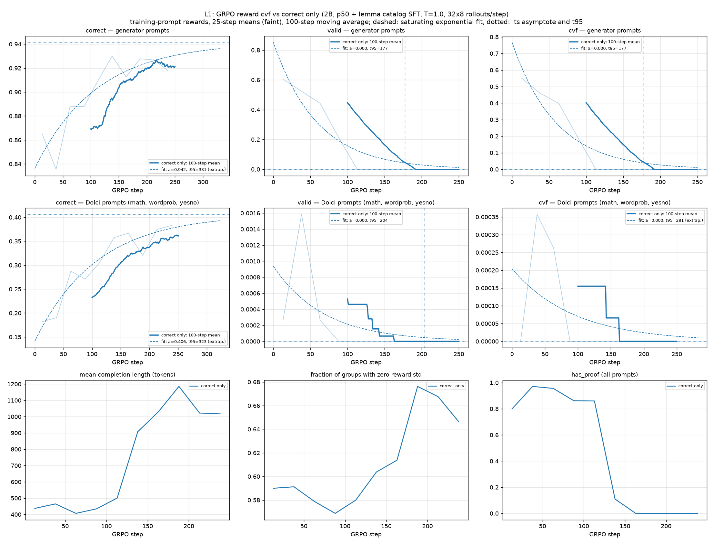
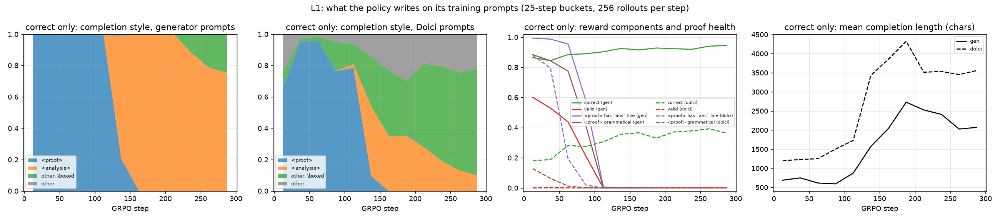

# L1 interim: correct-only GRPO drops the formal proof format within ~150 steps (2026-09-30, 23:59)

**Question (user):** under RL with validity × correctness reward vs correctness-only reward for 2k–5k steps, when does each arm converge in correctness and in validity, and at what value?

**Setup:** both arms start from the same checkpoint, `qwen35_2b_p50_cont_lc_fp32m` final (2B, p50 mixture + lemma-catalog SFT). GRPO runs 5000 steps with 32 prompts × 8 rollouts per step at T=1.0, on the same training prompts (generator + Dolci math/wordprob/yesno). The arms differ only in the reward:
- **correct only** (`L1_correct`, jobs 7969–7973, gruenau11): reward = correct.
- **cvf** (`L1_cvf`, jobs 7974–7978): reward = correct × valid × prem_ok. It starts when G10 (7888) frees its GPU, about 2026-10-01 04:30.

Rewards are scored with the frozen pre-libext checker (`checker_snapshot_pre_libext_20260930`). Held-out gates run every 250 steps (`scripts/submit_l1_gates.sh`). The checkpoint-250 gate for correct-only (8780) is queued.

**Status:** correct only is at step 300 of 5000 (~89 s/step). No cvf data yet. This note covers only the correct-only arm.

## 1. Validity: correct-only converges to 0, and fast

| training-prompt reward (correct only) | first 25 steps | last 100 steps (≤ step 250) | fit asymptote | fit t95 (steps) |
|---|---|---|---|---|
| valid, generator prompts | 0.605 | **0.000** | 0.000 | 177 |
| cvf, generator prompts | 0.551 | **0.000** | 0.000 | 177 |
| valid, Dolci prompts | 0.000 | 0.000 | 0.000 | – |
| correct, generator prompts | 0.865 | 0.921 | 0.942 | 331 (not reached) |
| correct, Dolci prompts | 0.182 | 0.361 | 0.406 | 323 (not reached) |

(`scripts/analysis/l1_convergence.py`. The fit is the saturating exponential y = a − (a − y0)·e^(−t/τ), with t95 = 3τ. The asymptote of a rate is now clipped to [0, 1]; before that, the fit extrapolated the validity collapse to −0.10. A plateau/converged verdict needs ≥ 1000 steps, so correctness is not called converged yet.)

**Validity answer, correct-only arm: converges to 0.000 at about step 100–180, depending on the criterion.** The last valid rollout on generator prompts is in the 75–100 bucket. Correctness keeps rising and has not converged: the fits point to ≈ 0.94 (generator) and ≈ 0.41 (Dolci) around step 330. With only 300 steps these are extrapolations.

## 2. How the format is lost: proofs rot first, then the tag goes

`scripts/analysis/l1_format_shift.py` reads the logged rollouts, 256 per step, in 25-step buckets. It shows three phases:

1. **Steps 0–100: proofs degrade inside `<proof>`.** On generator prompts the style is still 100% `<proof>`, but:
   - the share of proofs with an `ans` line drops from .99 to .006;
   - grammatical drops from .88 to .00;
   - valid drops from .60 to .00.

   The policy keeps the scaffold but stops finishing it. Typical rollouts at step ~100 are a few lines, a stray `back 1`, then `</proof>` and `Answer: yes`. Under correct-only reward, only the trailing `Answer:` line is scored.
2. **Steps 100–150: the tag is replaced.** On generator prompts `<proof>` goes from 99% to 0.1%, replaced by an `<analysis>` block of English chain of thought. On Dolci prompts it is replaced by markdown/LaTeX CoT ending in `\boxed{}`. This is the base instruct model's native style.
3. **After step 150:** no formal proofs at all. Completions are 3–4× longer (generator ≈ 600 → 2,000–2,700 chars; Dolci ≈ 1,200 → 3,500). Correctness keeps climbing slowly.

Before the switch, formal completions were *more* correct than natural-language ones on the same prompt source. At steps 100–125 on Dolci prompts: .33 formal vs .23 NL. So the switch is not explained by formal proofs being worse per sample. One possible explanation, not yet tested: formal proofs had already stopped carrying information (phase 1), so they became a cost with no benefit, and GRPO then shifted to the higher-variance, longer NL style that the base model's prior favours.

## 3. What this means for the question

- **The formal SFT prior is shallow.** About 100 GRPO steps undo it when nothing rewards it. Under a correct-only reward, validity is therefore not a quantity that converges to some interior value; it goes to zero.
- **In the correct-only arm, correctness is bought with NL CoT, not with proofs.** Its correctness curve (≈ .94 gen / ≈ .41 Dolci asymptote) is the reference ceiling the cvf arm should be compared against. The key cvf result will be how much of that correctness it reaches *while* staying valid, and how long it takes.
- The held-out gate at checkpoints 250, 500, … will show whether the Dolci correctness gain transfers (step 0: gate correct .224, valid .007; gen test correct .913, valid .786).

## Next

- Submit gates every 250 steps for both arms and refit every loop tick. Write the full report when both arms pass ≥ 1000 steps (correct-only ≈ 2026-10-01 18:00, cvf ≈ 2026-10-02 05:00).
- If cvf also stalls in validity, the next arms are a shaped reward (`lines` / `frac_hard`) or a correct + λ·valid mix, to find where the trade-off turns.
