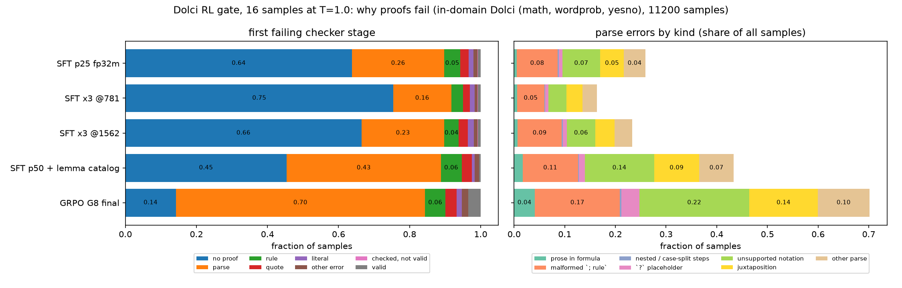
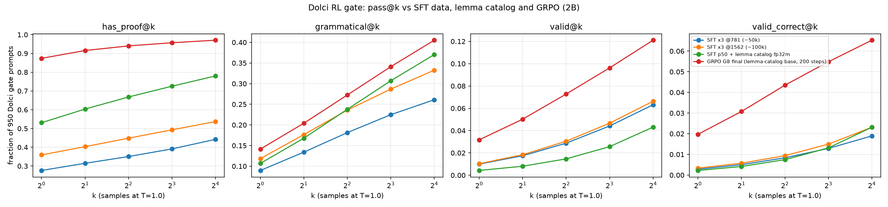

# 2026-09-30: library extension, checker regression check, and why sampled proofs fail on Dolci

Context: the approved plan (self-distillation on real prompts, "lemmas everywhere", the Dolci mix, and an RL push).
This note covers three things: the library extension, a check that the new checker does not change any
existing verdict, and a breakdown of how sampled proofs fail on the Dolci RL gate. That breakdown shows where
the remaining validity has to come from.

## 1. Library extension (RLVL-next `rlvl/lib`, `gen/rlvlgen`)

- 75 new lemmas in five modules:

  | module | lemmas | covers |
  |---|---|---|
  | `nt` | 26 | int, mod, parity, dvd, gcd, lcm, prime |
  | `alg` | 13 | squares, sums 1..n, means, linear equations |
  | `comb` | 5 | factorials, permutations, combinations |
  | `geom` | 22 | areas, perimeters, volumes, circles, angles, triangles, midpoints |
  | `rate` | 9 | distance/speed/time, work, unit prices, percent |

- They come with six opt-in generator families (`dataset.EXTRA`): `lemmas`, `mathlemmas`, `numth`, `geom`,
  `rates`, `counting`. See DESIGN.md §5 and §8.1.
- These families are kept out of `FAMILIES`, so every existing pool can still be rebuilt bit for bit.
- The demand side came from `analysis/lib_coverage.json` (`scripts/analysis/lib_coverage.py`). On the Dolci
  gate, the x3 @1562 SFT model makes 453 lemma citations, and 285 of them name lemmas that did not exist.
  The most frequent: `math.gcd_def`, `count.add`, `calc.sub`, `set.sum_def`, `motion.density`, `gcd.step*`,
  `geometry.cut_iff`.

The live checker .so in RLVL-next changed at 17:50 today. Every comparative run and eval stays on the frozen
snapshot `rlvl_data/checker_snapshot_pre_libext_20260930` (via `RLVL_PYTHONPATH`) until a new arm is trained on
the new families. Pending evals that would have picked up the new .so were resubmitted pinned: 8169, 8170, 8171.

## 2. Old vs new checker on existing outputs: no regressions, no gains

The lib agent flagged a possible name clash: policies often `def` the symbols `area`, `base` and `prime`,
which are now lib symbols. To test this, I rescored two sets with `formal_rewards.components` (the GRPO
reward) under both checkers:

- all 27,598 passing completions of the G8-final harvest (`rl_filter_20260930`);
- all 15,200 G8-final k16 samples on the Dolci gate.

| set | n | valid old → new | cvf old → new | verdicts changed |
|---|---|---|---|---|
| harvest: gen | 26,549 | 1.000 → 1.000 | 1.000 → 1.000 | 0 |
| harvest: wordprob / yesno / math | 911 / 111 / 27 | 1.000 → 1.000 | 1.000 → 1.000 | 0 |
| gate: wordprob | 3,200 | .0619 → .0619 | .0472 → .0472 | 0 |
| gate: yesno | 3,200 | .0206 → .0206 | .0181 → .0181 | 0 |
| gate: knowledge | 1,600 | .0281 → .0281 | 0 → 0 | 0 |
| gate: math / dapo | 4,800 / 2,400 | 0 → 0 | 0 → 0 | 0 |

- The two binaries differ (md5), but no verdict changed on any of the 42,798 samples.
- Only 2 error messages changed. In both, an ill-typed formula became a later-stage error: an unknown lemma
  `route.dist` in one, a quote mismatch in the other.
- So the name clash does not hurt existing policies. The new lemmas also cannot help them yet: G8 never cites
  them, and most samples fail before any lemma lookup (section 3).
- The gain from the extension has to come from training on the new families, followed by an eval under the new
  checker.

## 3. Why sampled proofs fail on the Dolci gate

`scripts/analysis/gate_error_breakdown.py` → `analysis/gate_error_breakdown.json`

Setup:
- Data: the 700 in-domain Dolci prompts (math, wordprob, yesno) × 16 samples at T=1.0, scored with the frozen
  checker.
- Left panel: the first checker stage each sample fails.
- Right panel: parse errors split by the text at the error position. This split is a heuristic regex
  classifier (see the script docstring); treat its shares as ±a few points.

| model | no proof | parse | rule | quote | literal | valid |
|---|---|---|---|---|---|---|
| SFT p25 fp32m | .638 | .259 | .046 | .023 | .014 | .008 |
| SFT x3 @1562 | .665 | .233 | .041 | .025 | .017 | .008 |
| SFT p50 + lemma catalog | .454 | .434 | .059 | .028 | .008 | .004 |
| GRPO G8 final (cvf, 200 steps) | .142 | .701 | .058 | .031 | .015 | .035 |

**Findings:**

- **GRPO mostly turned "no proof" into "parse error".** Proof attempts rose from 55% to 86%, but 70% of all
  samples now fail to parse. Valid rose 9× (.004 → .035), yet that is still only 1 in 29 samples.
- **Rule and quote errors are small and flat.** Rule errors (unknown or misapplied lemmas) hold at 5–6% and
  quote errors at about 3% across all models. The library extension targets the rule errors, so on its own it
  can recover at most about 6 points, and only after training.
- **The parse errors are the model reaching past the language.** G8, as a share of all samples:

  | kind | share | examples |
  |---|---|---|
  | notation the language lacks | .22 | `{k=1..n}`, `[2, 5, ...]`, `|A|`, `a_n`, `%`, `**`, `==`, `+=`, chained `a < x < b`, tuples |
  | malformed justification | .17 | no `; rule`, or bad rule arguments like `; know formula`, `; split into ...` |
  | juxtaposition | .14 | multi-word names (`total outcomes = 6`, `goal people eat pizza ?`), implicit products (`2(x+1)`) |
  | `?` placeholders | .04 | — |
  | prose in formulas | .04 | `n is the smallest ...` |
  | other | .10 | — |

  These errors are not "wrong lemma" failures. The model writes math notation or English that the formal
  syntax does not accept.

**Implications for the plan:**

1. **Self-distillation is the right lever.** The harvest (and the GSM8K-train harvest now running, 8176) consists
   of real-prompt proofs that parse. Training on it teaches the model to stay inside the syntax on real prompts,
   which is exactly the 70% failure mode. The generator data alone cannot teach this, because generator
   prompts never invite `{k=1..n}` or multi-word names.
2. **RL sees almost no signal here.** With binary cvf, a parse failure scores the same as no proof, so GRPO gets
   no gradient toward "parseable". A shaped reward like `lines` or `frac_hard` (already in `formal_rewards`)
   gives partial credit for parsed lines. It is worth an arm after L1, if the L1 cvf arm stalls on Dolci.
3. **Juxtaposition and notation can be taught cheaply.** The generator could render quantities with multi-word
   natural names ("total cost") that must be written as `total_cost`, and sums and lists could be spelled out
   with `alg.sum_formula`. Making the parser accept the common notations instead would be a language change and
   is out of scope for now.

## 4. Update 2026-10-01 01:00: the x3 SFT finished (150k generator rows), and pass@k barely moves

On the Dolci gate: 950 prompts, 16 samples at T=1.0, frozen checker (`analysis/passk_ladder.md`, `scripts/analysis/passk_ladder.py`, job 8171).

| SFT generator rows | has_proof@16 | valid@8 | valid@16 | valid·correct@16 |
|---|---|---|---|---|
| ~25k (p25 fp32m) | .629 | .041 | .059 | .022 |
| ~50k (x3 @781) | .442 | .044 | .063 | .019 |
| ~100k (x3 @1562) | .537 | .047 | .066 | .023 |
| ~150k (x3 final) | .513 | .055 | .076 | .021 |
| p50 + lemma catalog | .780 | .026 | .043 | .023 |
| + GRPO G8 (200 steps cvf) | .971 | .096 | .121 | .065 |

- Going from 25k to 150k generator rows adds +.017 valid@16 and nothing in valid·correct@16.
- 200 GRPO steps add +.078 valid@16 and ×3 valid·correct@16.

This confirms that dropping plain data-scale midtraining was right, and that the budget belongs with self-distillation (EI), the new lemma families and RL (the c/l/e/le arms and L1).

**Data loss and fix.** `scripts/train_formal_mixture_sft.py` deleted every `checkpoint-*` dir when training ended. That included the x3 @781/@1562 gate outputs stored inside them. Their numbers survive in the committed tables (`analysis/passk_ladder.md`, `analysis/gate_error_breakdown.json`), and both analysis scripts now fall back to those records (`analysis/passk_ladder.json`). The cleanup now keeps any subdir of a checkpoint that holds a `summary.json`.

## 5. Interim 2026-10-01 02:10: arm l (new lemma families), first of the four continued-SFT arms

- Arm l is 7k new-family rows, 7k fresh generator rows and 6k Dolci rows, continued from the L1 base.
- Scored with the new lemma library (jobs 8209 and 8211; `analysis/libext_ei_arms.md`, `scripts/analysis/libext_ei_arms.py`).

| | base | l |
|---|---:|---:|
| gate greedy valid / valid·correct / correct | .011 / .003 / .224 | .027 / .009 / .163 |
| gate T=1 valid per sample | .0043 | .0149 |
| gate valid@16 / valid·correct@16 | .043 / .023 | .086 / .028 |
| gate mixed@8 (valid) | .026 | .061 |
| gen test valid (default families) | .808 | .867 |
| new-family test valid | .010 | .952 |

- Validity on real prompts rises ×2.5–3.5 on every Dolci source.
  - Largest gains: math ×6 and knowledge ×4. Math is the source the new nt/alg/geom lemmas target.
  - valid@16 doubles, and the share of prompts with a non-zero GRPO advantage under a validity reward (mixed@8) goes from .026 to .061.
- Correctness drops: greedy .224 → .163, T=1 .186 → .151. valid·correct@16 rises only .023 → .028.
- Not yet attributable. The control arm c (fresh generator rows instead of new families; job 8214, done ~06:30) will show how much of the gain, and of the correctness loss, comes from 20k more SFT rows at all.
- For comparison, x3 (150k plain generator rows) reached valid@16 .076 from a different base (§4).

## 6. 2026-10-01 06:30: control arm c is in. The validity gain comes from the new families, not from more SFT

Same figure as §5 (`figures/libext_ei_arms.png`, now with c). Arm c = 14k fresh default-family generator rows + the same 6k Dolci rows, the same size as l. Jobs 8214 and 8215.

| metric | base | c: +fresh gen | l: +new families | l / c |
|---|---:|---:|---:|---:|
| gate greedy valid | .0105 | .0147 | .0274 | 1.9× |
| gate greedy valid·correct | .0032 | .0042 | .0095 | 2.3× |
| gate greedy correct | .224 | .201 | .163 | |
| gate T=1 valid / sample | .0043 | .0046 | .0149 | 3.2× |
| gate T=1 correct / sample | .186 | .164 | .151 | |
| gate valid@16 | .043 | .037 | .086 | 2.3× |
| gate valid·correct@16 | .023 | .014 | .028 | 2.1× |
| gate mixed@8 (valid) | .026 | .024 | .061 | 2.5× |
| gen test valid | .808 | .911 | .867 | |
| new-family test valid | .010 | .014 | .952 | |

- **More SFT on the old distribution does not transfer.**
  - c improves in-domain validity (gen test .81 → .91) but leaves gate validity flat: .0043 → .0046 per sample, and valid@16 .043 → .037.
  - This confirms the §4 / 2026-09-30 finding with a matched control.
- **The new lemma families do transfer.** l has 3.2× c's per-sample gate validity and 2.3× its valid@16, at the same SFT budget. The gain is not from the data volume; it is from lemma coverage that real prompts need (§3: >60% of failing lib cites named lemmas that did not exist).
- **Correctness cost, split.** Greedy gate correct falls .224 → .201 from more SFT at all (c), then a further .201 → .163 from l. The T=1 losses are −.022 and −.013.
  - The new families cost some correctness, probably because the model now attempts more formal answers on prompts it used to answer loosely.
  - Even so, valid·correct@16 is highest for l (.028), and c lowers it (.014).
- **Pending:** e (EI rows; SFT 8216 running, eval 8217) and le (both; SFT 8212 at 131/157, eval 8213). These decide whether self-distilled real-prompt proofs add on top of l. If le > l, then le is the next RL base, since a 2.5× higher mixed@8 means 2.5× more prompts with GRPO signal.

## 7. 2026-10-01 08:30: le (new families + self-distilled real-prompt proofs) is the best arm by far. The gain is not from gate contamination

Same figure as §5/§6 (`figures/libext_ei_arms.png`, now with le). The le arm is 4,457 EI rows + 7k new-family rows + 2.5k fresh generator rows + the same 6k Dolci rows (jobs 8212/8213). EI rows are G8 final's own checker-passing, correct proofs on Dolci wordprob/math and GSM8K-train prompts.

| metric | base | c | l | le | le / l |
|---|---:|---:|---:|---:|---:|
| gate greedy valid | .0105 | .0147 | .0274 | **.0684** | 2.5× |
| gate greedy valid·correct | .0032 | .0042 | .0095 | **.0379** | 4.0× |
| gate greedy correct | .224 | .201 | .163 | .196 | |
| gate T=1 valid / sample | .0043 | .0046 | .0149 | **.0420** | 2.8× |
| gate T=1 valid·correct / sample | .0022 | .0016 | .0060 | **.0266** | 4.4× |
| gate valid@16 | .043 | .037 | .086 | **.164** | 1.9× |
| gate valid·correct@16 | .023 | .014 | .028 | **.079** | 2.8× |
| gate mixed@8 (valid) | .026 | .024 | .061 | **.120** | 2.0× |
| gen test valid | .808 | .911 | .867 | .823 | |
| new-family test valid | .010 | .014 | .952 | .958 | |

- **le has ~10× the base's per-sample gate validity and 12× its valid·correct.** This is from 20k SFT rows and no RL. It reaches about 40% of G10@500's greedy valid·correct (.107), which took 1,100 GRPO steps.
- Per source (T=1 valid per sample): wordprob .020 → .127 (×6 over l), knowledge .039 → .061, yesno .018 → .024, math .008 → .011, dapo .0004 → .0017.
  - The EI proofs are mostly word problems, and wordprob is where the gain lands.
  - Math and dapo move little. The EI pool had almost no math proofs: 27 passing completions from 6 prompts, §1 harvest.
- Correctness recovers part of l's loss: greedy .163 → .196 (base .224).
- **The EI-to-gate overlap is negligible.**
  - 0 shared ids and 1 exact text match.
  - 5 of 1,759 EI prompts share a 12-gram with 7 gate items.
  - On the 943 gate items with no shared 12-gram, le scores greedy valid .064, valid·correct .033, and T=1 valid .040. l scores .026, .009 and .014 there.

### Gate contamination audit (all evals)

The audit then widened from the EI rows to the full training-prompt pool that RL and EI draw from: Dolci train rows of all gate benches (held-out rows excluded), plus GSM8K train, 74,669 prompts. `scripts/analysis/gate_contamination.py` measures 12-gram coverage and ignores template 12-grams that occur in more than 50 prompts. The output is `analysis/gate_contamination.md` plus `contamination.json` next to the gate's `test.jsonl`.

| gate bench | items | near-duplicate in pool (coverage ≥ .3) | ≥ .9 |
|---|---:|---:|---:|
| dolci_math | 300 | 128 | 82 |
| dolci_dapo | 150 | 61 | 41 |
| dolci_wordprob | 200 | 30 | 21 |
| dolci_yesno | 200 | 18 | 2 |
| dolci_knowledge | 100 | 0 | 0 |
| all | 950 | 237 | 146 |

- **Dolci-Instruct-RL repeats problems under other row indices** (reworded, re-spaced, or with an image link), so holding out by row index left 25% of the gate with a near-duplicate in the pool. The "OOD" dapo items have near-duplicates among the dolci_math pool rows. The closest rows: dolci_math 177, dolci_dapo 23, yesno 18, GSM8K train 16, wordprob 3.
- **None of the conclusions depend on it.** `scripts/analysis/gate_clean_rescore.py` rescored all 70 gate evals on the 713 clean items (`analysis/gate_clean_rescore.md`, `figures/gate_clean_rescore.png`):
  - Every model scores *lower* on the contaminated items, because they are mostly the hard math and dapo items. Example: L1 base correct is .261 on clean items and .114 on contaminated ones.
  - Gains are similar or larger on the clean items:

    | change | clean | contaminated |
    |---|---|---|
    | L1 correct-only @500, correct | +.199 | +.194 |
    | G10@500 (cvf), valid | +.289 | +.148 |
    | le, valid | +.067 | +.030 |

  - There is no sign that training on near-duplicates inflated any gate number.
  - From now on, report the clean-subset numbers alongside the full-gate ones.
- **Prevention:** `grpo_formal.py --exclude-ids <contamination.json>` drops the 765 pool rows that cover a gate item ≥ .3: 654 dolci_math, 47 dapo, 44 yesno, 16 GSM8K, 4 wordprob. New RL runs use it, starting with G13. Already-running runs (L1, G11, G12) keep their pools so that their arms stay comparable.

### Next: G13 = le final + GRPO (cvf_fmt)

- le has 2× l's mixed@8 and 4.6× the base's, so far more gate-like prompts give GRPO a non-zero advantage. Following the decision rule in §6, it is the next RL base.
- Config:
  - G13 runs with L1's config: gen/dolci_math/wordprob/yesno, 3000 per bench, 1000 steps, saves every 50, keeps weights every 250.
  - Reward cvf_fmt.
  - `--exclude-ids` is on.
  - Checker: the new-library snapshot `rlvl_data/checker_snapshot_libext_20261001` (md5 of `_rlvl.abi3.so` = 7320e07c…).
- Jobs 9720 → 9721 on gruenau12, run `2b_le_G13_cvffmt`.
- Comparison: L1_cvf (L1 base + cvf_fmt from step 51; frozen old checker) at matched steps. G13's checkpoint gates must use the new checker. L1_cvf's gates use the old checker, which changes 0 of 42,798 verdicts on old-library proofs (§2).
