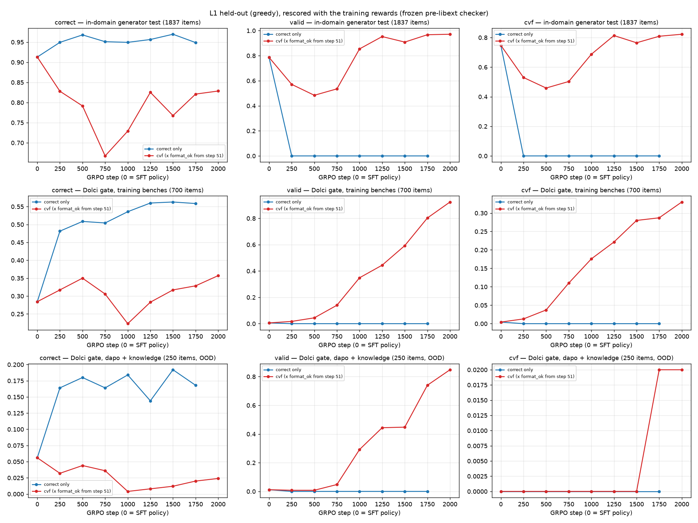
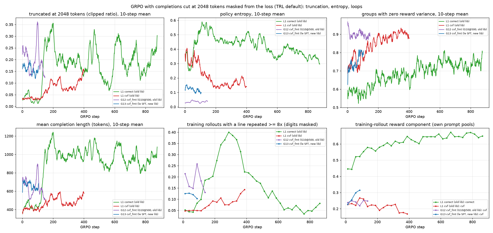

# GRPO, 2026-10-01: L1 held-out gates, truncation masking and the G14 fix arm

**Summary.**
- Correct-only GRPO (L1_correct): correctness on its own training prompts converged by step ~600, at .46 on Dolci and .95 on the generator. Held-out greedy correctness is still creeping up: .460 at step 500, .481 at step 1000 (paired z = 1.5). Validity has been 0 since step ~180.
- The cvf arm (L1_cvf) at step 250 nearly triples clean-gate validity, .014 → .039. Correctness is flat (.261 → .269).
- On held-out generator problems, though, L1_cvf *loses* 20 points of validity (.807 → .605).
- About a quarter of that loss is length truncation, mostly repetition loops. TRL masks truncated completions out of the GRPO loss, so the loops are never penalised.
- G14 is a new fix arm: G13 with truncated completions kept in the loss plus a 0.5 overlong penalty. To keep the GPU budget constant, G12 (old library, flat reward) is paused at checkpoint-150.
- The other three quarters of the loss are sloppier proofs (parse and rule errors). These point to policy drift; GRPO runs with beta = 0, i.e. no KL anchor to the SFT model.

All gate numbers use the **clean** gate subset: the 713 of 950 items with no near-duplicate in the training-prompt pool. They are greedy and scored by the frozen pre-libext checker.

## 1. L1 held-out gates (steps 0–1000)

| checkpoint | gate correct (clean) | gate valid (clean) | gate valid·correct (clean) | OOD correct (250) | gen_test correct | gen_test valid | gen_test cvf |
|---|---:|---:|---:|---:|---:|---:|---:|
| base (`p50_cont_lc_fp32m` final) | .261 | .014 | .0042 | .056 | .913 | .786 | .747 |
| L1 correct @250 | .438 | 0 | 0 | .164 | .949 | 0 | 0 |
| L1 correct @500 | **.460** | 0 | 0 | .180 | .968 | 0 | 0 |
| L1 correct @750 | .446 | 0 | 0 | .164 | .951 | 0 | 0 |
| L1 correct @1000 | **.481** | 0 | 0 | .184 | .949 | 0 | 0 |
| L1 cvf @250 | .269 | **.039** | **.022** | .032 | .828 | .571 | .530 |
| L1 cvf @500 | .309 | **.077** | **.055** | .044 | .792 | .484 | .459 |

Sources:
- `analysis/gate_clean_rescore.md` and `analysis/l1_convergence.json`.
- gen_test: 1837 held-out generator problems, rescored with the training reward.
- OOD: the 250 gate items from benches that are not in the RL pool.

**Correct only.** Held-out correctness rises .261 → .460 by step 500, then stalls (.446 at step 750). Training-prompt correctness also flattens: the fit gives a Dolci asymptote of .45 with t95 ≈ 540 steps. **Correctness looks converged from about step 500, at about .45 (clean gate) / .47 (Dolci training prompts) / .96 (generator).** The final call comes at step 1000, when the plateau test has enough steps.

**Update, correct @1000 (gate 9859, 18:35).**
- *Training prompts:* converged. The plateau test (last 100 steps within the fit's noise band) fires for Dolci correct at .459 from step ~970 (fit asymptote .452, t95 ≈ 525). Generator correct plateaus at .953 from step ~630.
- *Held-out, clean gate (greedy):* not flat yet. Correctness goes .438 → .460 → .446 → .481 at steps 250/500/750/1000.
  - Paired over the 713 clean items: step 250 → 1000 = +4.3 pp (SE 1.5, z = 2.9); step 500 → 1000 = +2.1 pp (z = 1.5).
  - So held-out correctness still gains about 1 pp per 250 steps. Training-prompt sampled correctness has stopped moving, so the most likely source is the greedy decode sharpening. OOD correctness (250 items) is .184, level with step 500.
- *Answer so far, correctness reward:* correctness converges at ≈ .46 (Dolci, sampled) / .95 (generator) by step ~600, with a slow held-out tail (.48 at step 1000). Validity converges to exactly 0 by step ~180: the policy drops `<proof>` completely. The run continues toward 5000 steps to test for a late tail. Validity converged to 0 by step ~180 (see the 2026-09-30 interim report).

**cvf.** By step 250, clean-gate validity has nearly tripled (.014 → .039) and valid·correct has grown fivefold (.004 → .022). Both are still tiny. Gate correctness is flat. On the generator, where the base model is already strong, every metric drops: valid .786 → .571, cvf .747 → .530. Training-prompt cvf on generator prompts falls too, .584 (first 25 steps) → .541 (last 100). So the arm is getting worse at its own reward on the prompts where it was good. Section 2 looks at why.

**Update, cvf @500 (gate 9858, 17:50).** The trade-off continues in both directions.
- Clean-gate validity doubles again (.039 → .077), as does valid·correct (.022 → .055). Gate correctness rises a little too (.269 → .309).
- Generator validity keeps falling: .571 → .484 (base .786).
- The cvf arm is converting generator validity into Dolci validity, at roughly 1 point gained on the gate per 2 points lost on the generator. Neither side has plateaued.

## 2. Why the cvf arm loses generator validity

The held-out generator test (`formal_eval`, 2000 items, greedy) classifies each completion by its first failure:

| first failure | base | L1 cvf @250 | Δ (pp) |
|---|---:|---:|---:|
| valid | .807 | .605 | −20.2 |
| rule error (lib/mp/and/calc/…) | .127 | .194 | +6.7 |
| parse error (not truncated) | .019 | .093 | +7.4 |
| truncated at 2048 tokens | .004 | .051 | +4.7 |
| literal / type error | .002 | .028 | +2.6 |
| other (answer, quote, scope, …) | .041 | .029 | −1.2 |

Two other shifts at step 250:
- **Repetition loops** (a proof line repeated ≥ 8 times, digits masked) went from .004 to .040 of completions. Every looped completion is invalid. Typical example: `94 heavier(erin, ravi) ; given …`, `95 lighter(…)`, `96 heavier(…) ; mp 95 94`, repeated with renumbered lines until the 2048-token limit.
- **Mean length** went from 260 to 321 tokens.

So **truncation and loops cost about 5 of the 20 points.** The other 15 are proofs that end but are wrong: malformed lines, rules applied to lines that do not license them, and type slips.

## 3. Training dynamics: truncated completions get no gradient

`grpo_formal.py` ran every arm with TRL's default `mask_truncated_completions=True`. A completion that reaches the 2048-token limit is dropped from the loss. Most such completions are loops: P(loop | truncated) is .60–.90 for the cvf arms. A loop therefore never receives the negative advantage its reward of 0 would give it.

| arm | steps | truncated (clipped ratio) | entropy | zero-variance groups | mean length (tok) | loop share | rollout reward |
|---|---|---|---|---|---|---|---|
| L1 correct (old lib) | 1–870 | .044 → .233 | .316 → .327 | .59 → .75 | 437 → 976 | .052 → .078 | .447 → .654 (correct) |
| L1 cvf (old lib) | 1–395 | .033 → .134 | .343 → .162 | .73 → .90 | 411 → 551 | .047 → .137 | .225 → .174 (cvf) |
| G12 cvf_fmt (G10@500, old lib) | 1–144 | .236 → .153 | .031 → .037 | .90 → .89 | 710 → 559 | .214 → .133 | .239 → .254 (cvf) |
| G13 cvf_fmt (le SFT, new lib) | 1–103 | .165 → .144 | .135 → .101 | .73 → .80 | 687 → 624 | .125 → .103 | .236 → .319 (cvf) |

Notes:
- The first and last columns of each range are means over the first and last 25 logged steps.
- Loop share and reward are 25-step bins of the 256 training rollouts per step.
- Source: `scripts/analysis/grpo_loop_collapse.py` → `analysis/grpo_loop_collapse.md`.

Truncated rollouts over the last 50 logged steps:

| arm | truncated share | P(loop \| truncated) | P(truncated \| loop) | mean advantage of truncated (masked) |
|---|---:|---:|---:|---:|
| L1 cvf | .111 | .84 | .72 | −.019 |
| G12 | .164 | .90 | .84 | −.039 |
| G13 | .142 | .60 | .76 | −.010 |
| L1 correct | .225 | .16 | – | −.178 |

What the curves show:
- **L1 cvf collapses slowly:**
  - truncation .03 → .13;
  - loops .05 → .14;
  - entropy halves (.34 → .16);
  - 90% of groups end up with zero reward variance, so they carry no signal;
  - the reward itself falls.
- **L1 correct** went through a loop phase: loops peaked at .40 around step 290. Then it abandoned `<proof>` altogether. Its truncations are now long natural-language reasoning (P(loop | truncated) = .16).
- **G12 and G13** are not collapsing yet; their loop share falls.

Masking alone is not the whole story, though. Under cvf most truncated loops sit in groups where every member has reward 0. Unmasking them would add only a weak signal: their mean advantage is about −.01 to −.04.

## 4. G14: unmask truncated completions and penalise them

G14 (run `2b_le_G14_cvffmt_overlong`; jobs 9825 → 9826 on gruenau12, started 14:43) is G13 with two flags: `--no-mask-truncated --overlong-penalty 0.5`.
- The start, prompts, reward (cvf_fmt), new checker and hyperparameters are all the same as G13.
- Truncated completions stay in the loss and get an extra reward term of −0.5.
- In an otherwise all-zero group, the loop now gets a clearly negative advantage and its siblings a small positive one. Groups that used to carry no signal now do; this is DAPO-style overlong shaping.
- Code: `scripts/formal_rewards.py`, `make_truncated` and `reward_funcs(arm, overlong_penalty, max_len)`; `scripts/grpo_formal.py`, `--no-mask-truncated` and `--overlong-penalty`. The defaults are unchanged, so the running L1 and G13 chains behave as before.

**First step (14:50).** The reward is .225, i.e. cvf_fmt .293 − 0.5 × truncated share .137, so the penalty is active. Only .28 of groups have zero reward variance; G13 at step 1 had 0.62, so most groups now carry a learning signal.

What to compare at matched steps (100, 250), G14 vs G13:
- truncation share;
- loop share;
- entropy;
- zero-variance groups;
- clean gate valid / valid·correct;
- gen_test valid.

Caveat on entropy: TRL averages entropy over the tokens in the loss. G14's entropy therefore also covers truncated completions, which G13's excludes, so entropy is not strictly comparable between the two. Truncation share, length, loop share and the gates are comparable.

**Steps 1–15 (15:38).**
- Truncation: G14 .175 → .152, G13 .172 → .177.
- Mean length: G14 692 → 657, G13 689 → 714.
- Zero-variance groups: G14 .29–.31, G13 .69–.72.
- Early and within noise, but in the expected direction.

Section 2 caps what this can fix: about a quarter of the cvf arm's generator loss. If G14 removes loops but the parse/rule drift remains, the next arm is a KL anchor (beta 0.02–0.04; GRPO currently runs with beta = 0).

**GPU budget.** G14 replaces G12 on gruenau12. G12 is paused after checkpoint-150:
- 9655 cancelled after the save;
- its next chain link 9656 is on `scontrol hold`; `scontrol release 9656` resumes it from checkpoint-150.

Why G12: it is the weakest arm.
- It uses the old library.
- Entropy is .03.
- Rollout cvf is flat (.239 → .254 over 144 steps).
- At 200 s/step, the remaining 850 steps would need about 47 h.

**Steps 1–125 (20:50): the fix works on its target, at no cost in reward.** Training rollouts, 25-step bins (`analysis/grpo_loop_collapse.json`):

| steps | G13 truncated | G14 truncated | G13 length (tok) | G14 length (tok) | G13 loops | G14 loops | G13 rollout cvf | G14 rollout cvf | G13 zero-var | G14 zero-var |
|---|---:|---:|---:|---:|---:|---:|---:|---:|---:|---:|
| 1–25 | .165 | .106 | 687 | 557 | .125 | .096 | .228 | .221 | .73 | .42 |
| 26–50 | .179 | .004 | 696 | 303 | .127 | .030 | .256 | .245 | .72 | .70 |
| 51–75 | .146 | .002 | 641 | 269 | .121 | .023 | .299 | .291 | .76 | .72 |
| 76–100 | .138 | .002 | 618 | 253 | .103 | .018 | .315 | .308 | .80 | .76 |
| 101–125 | .175 | .001 | 691 | 252 | .124 | .014 | .270 | .286 | .81 | .80 |

- **Truncation.** G14 stops hitting the 2048-token limit within about 30 steps: .106 → .001. G13 stays at .14–.18 throughout.
- **Loops.** The loop share falls by a factor of 7 (.096 → .014). G13's stays at .10–.13.
- **Length.** Completions get much shorter, 557 → 252 tokens, close to the SFT model's 260 on gen_test.
- **Speed.** Steps are 38% faster: 127 s against G13's 204 s.
- **Reward.** Training-rollout cvf tracks G13 within ±.015 in every bin, so the penalty took the loops away without costing reward.
- **Zero-variance groups.** G14's early advantage (.42 vs .73) was transient. From step 50 both arms sit at .70–.80, because most groups are all-0 or all-1 on cvf.
- **Entropy.** G14 .28 → .42; G13 .135 → .058. Truncation is now ~0 in G14, so masking no longer distorts the comparison. Length still confounds it, though: the boilerplate tokens of long completions have low entropy. Read it as "G14 is not collapsing", not as a quantitative gap.
- **Still open.** Whether G14 improves *held-out* validity: the clean gate and gen_test at step 250, around 01:00 on 2026-10-02 at the faster step time. G13's step-250 gate comes around 22:30.

**Side observation (L1 arms, same table in §3).**
- L1_correct is now truncating 25% of its rollouts (from 4%), with a mean length of 1010 tokens, but only 1.3% of rollouts are loops. Its truncations are long natural-language reasoning, not loops. Because they are masked, they get no gradient.
- L1_cvf's loop share keeps climbing, .047 → .182 by step 658, with 19% truncated.
- Neither L1 arm was launched with the fix, and both keep running unchanged for comparability with the convergence question.

## 5. G14 fixes the loops but abandons the proof on Dolci; G16 closes that exit (2026-10-02)

**Held-out at step 250, clean gate (713 items) and generator test** (`analysis/gate_clean_rescore.md`, `<ckpt>/formal_eval/summary.json`):

| policy | clean valid | clean valid·correct | clean correct | gate has_proof | gen_test valid | gen_test answer acc | gen_test tokens |
|---|---:|---:|---:|---:|---:|---:|---:|
| le SFT (init of G13, G14) | .081 | .042 | .231 | .878 | | | |
| G13@250 (cvf_fmt, truncation masked) | .129 | .079 | .213 | .966 | .750 | .851 | 379 |
| G14@250 (+ unmasked, overlong −0.5) | .094 | .056 | **.313** | **.487** | .723 | .895 | 224 |
| e2 SFT (init of G15, G16) | .171 | .086 | .273 | .972 | | | |

- **G14 has the best clean correctness of any 2B policy so far (.313), but writes a proof on only 49% of gate items.** 570 of its 950 gate outputs contain no `<proof>`: 433 end in `Answer:`, 77 in `\boxed`, 60 otherwise. They are short informal solutions, mostly on dolci_math (278) and DAPO (147), the hard benches.
- **The shift happens in training, within 25 steps.** Training rollouts on Dolci prompts, 25-step bins (`analysis/l1_format_shift.json`, figure `reports/figures/l1_format_shift.png`):

| steps | G13 `<proof>` share | G14 `<proof>` share | G13 correct | G14 correct | G13 valid | G14 valid | G13 chars | G14 chars |
|---|---:|---:|---:|---:|---:|---:|---:|---:|
| 0–24 | .89 | .66 | .15 | .16 | .03 | .03 | 1771 | 1502 |
| 25–49 | .86 | .13 | .14 | .16 | .04 | .04 | 1803 | 824 |
| 100–124 | .92 | .29 | .16 | .21 | .06 | .05 | 1820 | 599 |
| 250–274 | .98 | .26 | .16 | .21 | .08 | .07 | 2036 | 522 |
| 400–424 | 1.00 | .37 | .17 | .24 | .09 | .08 | 2169 | 586 |

  On generator prompts both arms keep 100% proofs and the same valid rate (.64–.76).
- **Why: under G14's reward, prose is a safe harbour.** cvf_fmt scores 0 for both a failed proof and an answer without a proof; only truncation costs −0.5. On a hard Dolci prompt a long formal attempt risks the length limit, while three lines of prose cannot be truncated. The policy learns the cheapest exit, and prose also raises plain correctness (rollout correct .16 → .24). The reward is indifferent to it: cvf_fmt is ~.26 in both arms by step 400.
- G13 shows the opposite failure: 100% proofs on Dolci, completions growing to 2,200 chars, and loops rising (§3). So masking keeps the format but loops, and the overlong penalty fixes loops but lets the policy leave the format.

**G16 = G15 + `--no-proof-penalty 0.5`** (run `2b_e2_G16_cvffmt_overlong_noproof`, job 10026 on gruenau12, started 2026-10-02 ~10:00).
- An answer without a `<proof>` block gets −0.5 like a truncated one. Under `<formal>` a missing proof is a format failure. The ordering becomes correct+valid proof (1) > failed proof (0) > prose = truncated (−0.5).
- Code: `make_no_proof` and `reward_funcs(..., no_proof_penalty)` in `scripts/formal_rewards.py`; the `--no-proof-penalty` flag in `scripts/grpo_formal.py`.
- It starts from the e2 SFT (EI round 2, the best SFT arm: clean valid .171). Everything else is the G14 recipe and the new-library checker.
- **G15** (e2 SFT + G14 recipe, no proof penalty; job 10008 on gruenau10) is the matched control. At step 0 it writes proofs on 96% of Dolci rollouts. If it drifts like G14, G16 − G15 measures the effect of closing the exit.
- What to read at step 250: Dolci `<proof>` share in training, then clean valid and valid·correct against e2 SFT (.171 / .086). Whether G16 keeps G14's correctness gain is open; it may hold correctness at e2's .273 instead.

**GPU placement.**
- G13 was stopped at step 439 (jobs 9720/9721 cancelled). Its question is answered: masked cvf_fmt keeps the format and grows loops. Checkpoint-400 is gated in job 10021, so the G13 trajectory is 250 → 400.
- The freed card was the only clean L40 on gruenau12: another user keeps a ~20 GB process on every other L40, and GRPO needs ~43 GB. Slurm hands out the lowest free GPU index, so the L1_correct gate (10003), the G13@400 gate (10021) and a 3-minute placeholder job were started first. G16 then got the free card (IDX3, 45.5 GB free). My gruenau12 total stayed at ≤ 5 of 10 GPUs.
- G15 stays on a shared A100 on gruenau10 at ~340 s/step, about 2.3× slower than an L40 to itself. Its step-250 gate is about a day away.
- G14 keeps running toward 1000 steps (step 464 at 10:00) to show whether the proof share recovers; it was .37 at 400–424.

## 6. L1 update and first G15/G16 steps (2026-10-02 13:40)

**L1, the question "when does each reward converge, and at what value".** Clean gate (713 items, greedy; `analysis/gate_clean_rescore.md`):

| step | correct-only: correct | correct-only: valid | cvf: correct | cvf: valid | cvf: v·c |
|---:|---:|---:|---:|---:|---:|
| 250 | .438 | 0 | .269 | .039 | .022 |
| 500 | .460 | 0 | .309 | .077 | .055 |
| 750 | .446 | 0 | .265 | .157 | .101 |
| 1000 | .481 | 0 | .201 | .400 | .161 |
| 1250 | .494 | 0 | – | – | – |
| 1500 | .509 | 0 | – | – | – |

- **Correct-only.** Correctness rises fast to about .44 by step 250, then climbs slowly (+.07 over steps 250–1500). It has not fully plateaued, but the gains are small. Validity is 0 at every checkpoint: without a validity term the policy never writes a checkable proof. On training rollouts the convergence fit (`analysis/l1_convergence.json`) puts correct_dolci at about .46 (converged by its criterion at about step 600) and generator correctness at .96.
- **cvf.** Validity is not converged at step 1000 and is still accelerating: clean valid .157 → .400 between steps 750 and 1000. On training rollouts, valid_dolci is at .277, with a fitted asymptote near 1, so it is still far from converged. Correctness falls at the same time (.309 → .201 clean), and v·c grows more slowly than validity. The policy learns to write valid proofs whose answers are wrong more often. That is consistent with formalizing an easier claim than the question asks (a faithfulness gap). At step 1000 the cvf policy has 2.5× more valid proofs than at step 750, but 0.2 lower clean correctness than the correct-only policy.
- Gates at cvf@1250 and cvf@1500 are needed to see where validity saturates. submit_l1_gates.sh queues them when the checkpoints appear (the run is at step 1370).

**G13@400** (le SFT, cvf_fmt, masked truncation): clean valid .115, v·c .066, correct .171. It is below G13@250 (.129 / .079 / .213) on every measure. Loops (.19 in rollouts) and truncation (.36) keep growing, so stopping G13 was right.

**G15/G16 early steps** (`l1_format_shift.json`, Dolci training prompts):

| arm | steps | Dolci proof share | Dolci correct | Dolci valid | loop share |
|---|---|---|---|---|---|
| G14 (le SFT) | 25–49 | .13 | .24 | – | – |
| G15 (e2 SFT) | 50–74 | .98 | .235 | .10 | .010 |
| G16 (e2 SFT + no-proof) | 75–99 | 1.00 | .214 | .131 | .002 |

G15 has not fled into prose even without the no-proof penalty, unlike G14, which started from the le SFT. The e2 SFT's proof habit is stronger: its Dolci proof share at step 0 is .99 against .66 for le. Whether G15 drifts later decides whether the G16 penalty matters. G16 runs at about 160 s/step, a little faster than expected, but 1000 steps still need a second 48 h job.

## 7. L1 at 1500 / 2000 steps (2026-10-02 22:00)

Clean gate subset (713 items, greedy; `analysis/gate_clean_rescore.md`):

| step | correct-only: correct | correct-only: valid | cvf: correct | cvf: valid | cvf: v·c |
|---|---|---|---|---|---|
| 1000 | .481 | 0 | .201 | .400 | .161 |
| 1250 | .494 | 0 | .234 | .501 | .191 |
| 1500 | .509 | 0 | .269 | .595 | .244 |
| 1750 | .504 | 0 | .288 | .783 | .267 |
| 2000 | .457 | 0 | – | – | – |

- **Correct-only has converged.** Correctness peaked at .51 around steps 1500–1750 and fell to .46 at step 2000. Validity stays 0. The step-2000 drop (−.05) is larger than the step-to-step noise so far (±.015). It could be the start of overfitting; step 2250 will tell.
- **cvf is still climbing on all three measures.** Validity rises by about .1 per 250 steps (.40 → .50 → .60). Correctness recovers from its step-1000 low (.20 → .23 → .27), so v·c grows faster than validity: .161 → .191 → .244. The fall in correctness around step 1000 was a transition, not a cost the run keeps paying. At this rate cvf could match the correct-only arm's .51 correctness only after several thousand more steps; the 4 queued chain links (to about step 3000) will show whether it gets there.
- Training-rollout fits (`analysis/l1_convergence.md`): valid_dolci at .70 over the last 100 steps with a fitted asymptote near 1 (t95 ≈ 7800 steps), not converged. correct_dolci .19 (rollouts are sampled at T = 1, so they run below the greedy gate).

### 7b. cvf at step 1750 (2026-10-03 01:00)

- **cvf validity jumps from .595 to .783 in one 250-step interval**, about twice the earlier rate. Clean v·c rises to .267, and correctness keeps recovering (.269 → .288).
- Out of distribution (the gate_ood benches, which no RL prompt comes from), validity is .74 but cvf only .02. The model now writes valid proofs there too, but almost all of them are wrong. Generator-test validity is .967.
- The gap to the correct-only arm's correctness (.50) shrinks to about .21. Validity is still rising and not saturated, so the convergence point is still open. The next links (2000, 2250, …) are queued.

## 8. G16 at step 500, G14 finished, L1_correct at 2250 (2026-10-03 04:20)

Clean gate subset (713 items, greedy; `analysis/gate_clean_rescore.md`):

| checkpoint | valid | v·c | correct |
|---|---:|---:|---:|
| G14@750 (le lineage) | .210 | .118 | .320 |
| G15@250 | .210 | .091 | .302 |
| G16@250 | .229 | .102 | .296 |
| **G16@500** | **.358** | .161 | .299 |
| **G14@1000 = final** | .311 | **.182** | .310 |

- **G16's no-proof penalty keeps paying off.** From step 250 to 500, validity rose by .13 and v·c by .06, while correctness held at .30. At step 500, G16 had the highest clean validity of any G run. With plain greedy decoding it matches G14@750 under guided decoding (.160 v·c). G16 is the EI round-4 teacher candidate. Round 3 (teacher G16@250) is training now.
- **G14 finished all 1000 steps** (`final` = step 1000). Its last 250 steps lifted clean validity from .210 to .311 and v·c from .118 to .182, the best clean v·c of any G run so far, with correctness at .310. Both lineages keep improving; G16 has another ~500 steps to go. The resume-only checkpoint-950 was deleted.
- **L1_cvf@2000: validity .900, v·c .286, correct .293** (clean). Validity is near saturation (.60 → .78 → .90 over steps 1500–2000) while correctness creeps up (+.005 per 250 steps). cvf's correctness still trails correct-only (.49) by about .20.
- **L1_correct@2250: correct .489**, back up from .457 at step 2000. The step-2000 dip was noise, not the start of overfitting. Correctness-only has plateaued at about .49–.51 since step 1500, with validity at 0.

## 9. G16 at step 750, L1_correct at 2500 (2026-10-03 09:40)

Clean gate subset (713 items), greedy, Stage-2 checker (`analysis/gate_clean_rescore.md`, `figures/gate_clean_rescore.pdf`).

| checkpoint | valid | v·c | correct |
|---|---:|---:|---:|
| G16@500 | .358 | .161 | .299 |
| **G16@750** | **.644** | **.209** | .264 |
| G14@1000 = final | .311 | .182 | .310 |
| L1_cvf@2000 | .900 | .286 | .293 |
| L1_correct@2500 | 0 | 0 | .485 |

- **G16's validity jumped from .358 to .644 in 250 steps.** It now has the best clean v·c of any G run (.209, ahead of G14 final at .182), even though correctness fell from .299 to .264. This is the same pattern L1_cvf showed between steps 1500 and 2000: validity rises fast once the format takes hold, and correctness lags. The contaminated subset moves the same way (valid .650, correct .203), so the jump is not an artefact of the clean filter. G16@750 is now the EI round-4 teacher candidate.
- **L1_correct@2500: correct .485.** That is within ±.03 of its value at every checkpoint since step 1250 (.494 / .509 / .504 / .457 / .489 / .485), so correctness-only converged at about .49 by roughly step 1250–1500.
- L1_cvf@2250 is being gated (job 10791).

## 10. Correction: resumed GRPO links restarted from the SFT weights (bug, fixed 2026-10-03 10:50)

**The L1_cvf@2250 gate collapsed (clean valid .900 → .013, Dolci proofs became prose inside `<proof>`).** The cause is a resume bug, not training dynamics. On every walltime resume, `Trainer` loaded `model.safetensors` with a raw `load_state_dict(strict=False)`. `save_pretrained` writes Qwen3.5 keys as `model.language_model.*`, but the in-memory model expects `model.*`, so every key "missed" (the warning `There were missing keys in the checkpoint model loaded` is in each resumed link's log). The policy therefore silently restarted from the SFT init, while the step counter, optimizer state, data position and LR schedule continued. The training-log validity of L1_cvf dropped from about .89 to .21 at the first step of link 9648 (resumed at 2102).

Affected links (every link that printed `resuming from`):

| run | resumed at | effect | what we did |
|---|---|---|---|
| L1_cvf | 50 (link 9647) | weights reset to the SFT init at step 50, the same moment the reward switched to `cvf × format_ok` | negligible: the x-axis is shifted by ≤ 50 steps |
| L1_cvf | 2102 (link 9648) | checkpoint 2250 = SFT init + 148 steps | stopped; ckpts 2250/2300 and completions > 2000 moved to `_resume_bug_20261003/`; resumed from checkpoint-2000 (weights + trainer state, fresh Adam) |
| L1_correct | 1848 (link 7970) | checkpoints 2000 / 2250 / 2500 = SFT init + 152 / 402 / 652 steps | stopped; ckpts ≥ 2000 and completions > 1750 moved aside; resumed from checkpoint-1750 |
| G15 | 100 (link 10009) | everything after step 100 is SFT init + (step − 100) | kept running: equivalent to a fresh run shifted by 100 steps (see below) |

G14, G16 and all earlier L1 links never resumed, so their numbers stand.

**Retractions:**
- §8 and §9 said L1_correct's dip at step 2000 (.457) was noise and that it had plateaued at about .49 since step 1250. The dip was the reset. The post-reset gates (.457 / .489 / .485 at 152 / 402 / 652 steps after the reset) are effectively a second run from the SFT init. They show that correctness-only reaches about .49 within about 400 steps, which reproduces the original climb (.438 @250, .460 @500) but faster, because there is no warmup and the Adam state was warm. The genuine trajectory ends at checkpoint-1750 (.504), which is where it now resumes from.
- §9 compared G16 with "L1_correct@2500"; that row is void. All G16 numbers stand.
- G15@250 is really "e2 init + 150 steps". Read G15 checkpoint *k* as fresh step *k − 100*.

**Fix** (`scripts/grpo_formal.py`): on resume, `GRPOTrainer` now gets the checkpoint directory as `model`, so `from_pretrained` applies the key mapping. A CPU check on L1_cvf/checkpoint-2000 shows exactly equal tensors (max diff 0.0), while the SFT base differs by 1e-4–3e-4. The raw resume load then matches nothing and leaves those weights alone. If no checkpoint with optimizer state survives, the script falls back to the newest checkpoint with weights + `trainer_state.json`; Adam restarts, with a 10-step warmup. This fallback is used now for both L1 runs.
