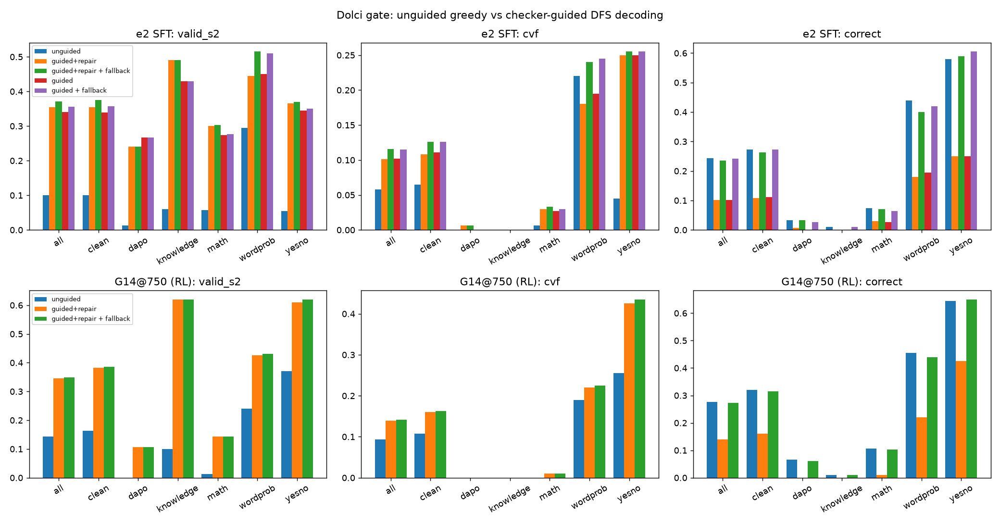

# Checker-guided DFS decoding on the Dolci gate (2026-10-02/03)

Code: `scripts/guided_decode.py` (decoder), `scripts/analysis/guided_decoding.py` (analysis).
Tables: `analysis/guided_decoding.md`. Figure: `reports/figures/guided_decoding.png`.

## What the decoder guarantees

The decoder works line by line inside `<formal>`.
- **Sampling:** it samples candidate next lines (one batched vLLM call per node).
- **Checking:** it runs each candidate through rlvl strict.
- **Stage-2 check on `ans`:** it applies the Stage-2 hardening to the `ans` line: grounded, the answer agrees, at least one checked derived ancestor, not circular, premise numbers stated in their quotes.
- **Forced tokens:** when only one continuation is possible, it appends that continuation without calling the model.
- **Search:** it backtracks depth-first to the last branching point when a node has no surviving candidate. `--repair` also lets it re-prompt a rejected line with the checker's error.

**Every proof it returns is valid under the same checker the cvf reward uses (found ⇒ valid_s2 = 1, by construction).** It does not guarantee that a proof is found (search budget), or that the proof is correct.

## Results (950 gate items; clean = 713 items without a near-duplicate in the training pool)

| model | decoding | valid_s2 all | cvf all | correct all | cvf clean | sampled tokens / item |
|---|---|---:|---:|---:|---:|---:|
| e2 SFT | unguided greedy | .100 | .058 | .244 | .065 | 732 |
| e2 SFT | guided | .341 | .102 | .102 | .111 | 4697 |
| e2 SFT | guided + fallback | .356 | .115 | .241 | .126 | 5252 |
| e2 SFT | guided + repair + fallback | .372 | .116 | .236 | .126 | 5016 |
| G14@750 (RL) | unguided greedy | .143 | .094 | .277 | .108 | 265 |
| G14@750 (RL) | guided + repair | .345 | .139 | .139 | .160 | 3030 |
| G14@750 (RL) | guided + repair + fallback | .348 | .142 | .273 | .163 | 3223 |

"fallback" = use the guided proof when found, else the unguided greedy completion. It keeps unguided correctness, because answers without a found proof are not lost.

## Findings

1. **Guidance more than doubles valid_s2 (×2.4–3.6) and raises cvf by 1.5–2×.** e2: cvf .058 → .116. G14@750: .094 → .142; clean .108 → .163, the best clean cvf on the gate so far. The RL'd model is a better proposer: more of its found proofs are correct (.40 vs .29), at 35% fewer sampled tokens.
2. **The gain is almost all on yesno and wordprob.** G14@750 yesno cvf .255 → .435, wordprob .19 → .225. On math, dapo and knowledge, cvf stays ≈ 0 even though valid_s2 rises (knowledge .10 → .62): the search finds *valid* proofs of *wrong* answers. Validity is cheap there; correctness is the bottleneck.
3. **The search does not improve correctness.** On the items where a proof is found, guided correctness is slightly *below* unguided greedy on the same items (e2 .299 vs .309; G14 .402 vs .415). Checker-acceptance doesn't select for right answers. 89–92% of found proofs rest on at least one **relation premise** (a `given` with no number, e.g. `chips_total = grid_size ; given "5x5 grid"`). Those modeling claims are where a wrong answer slips through while the proof is formally valid.
4. **Repair barely helps** (e2: found .341 → .355, cvf .102 → .101 / with fallback .115 → .116). Re-prompting with the checker's error rarely turns a rejected line into a useful one.
5. **Where the search fails** (G14@750): 409 exhausted (every branch dead) vs 213 out of budget. More budget would recover at most part of the 213.
6. **Agreement filter** (found ∧ guided answer = unguided greedy answer) gives a high-precision subset (G14: cvf .127 on the 20.9% of items it covers), but it loses cvf overall.

## Negative result: a lexical premise check cannot replace the semantic one

I tried to close the relation-premise loophole with a lexical test. Scripts are in `rlvl_data/guided_lexical_20261002/`.
- **Broad version:** every non-library identifier must prefix-match a word of its quote. It rejects 46 of the 55 unguided cvf = 1 proofs, so it is far too strict. Correctness among passing found proofs is .455 vs .252 among rejected, but only 55 of 337 pass.
- **Narrow version:** only new right-hand identifiers on digit-free given/obs lines. It passes everything, including 252 of 337 found proofs, and no longer separates correct from wrong (.278 vs .306).

Relation premises are modeling claims; checking them needs semantics (an LLM judge or a trained premise verifier), not string matching. So this stays as the one unverifiable step in the cvf reward and in guided decoding.

## Bug fixed along the way

Job 10249 (G14@750) crashed in `stage2`: rlvl accepted an `ans` line without the `ans <value> ;` shape, so `_ANS.match` returned None. The vLLM engine then hung, so Slurm kept showing the job as RUNNING. Fixed in d03b99d (such lines count as Stage-2 invalid) and rerun as job 10281.

## Takeaways for the plan

- Guided decoding is a **test-time add-on that guarantees validity** and gives the best gate cvf so far (clean .163 with G14@750). It costs about 12× the sampled tokens of greedy decoding. It is worth using as the decoder of record for "valid-proof-or-abstain" reporting.
- It does **not** fix correctness, so the RL and self-distillation work (better proposers) remains the main lever. The guided gain grows with proposer quality (e2 → G14: +.058 → +.048 absolute cvf at a higher base). It should be rerun on each new best checkpoint (EI round 3, G16, L1_cvf).
