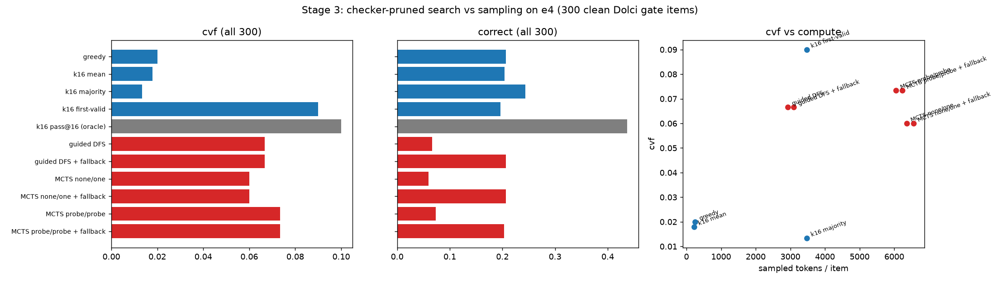
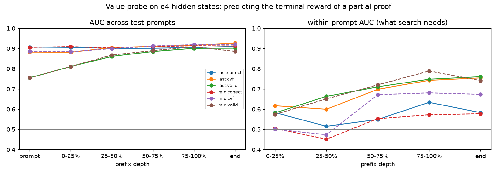
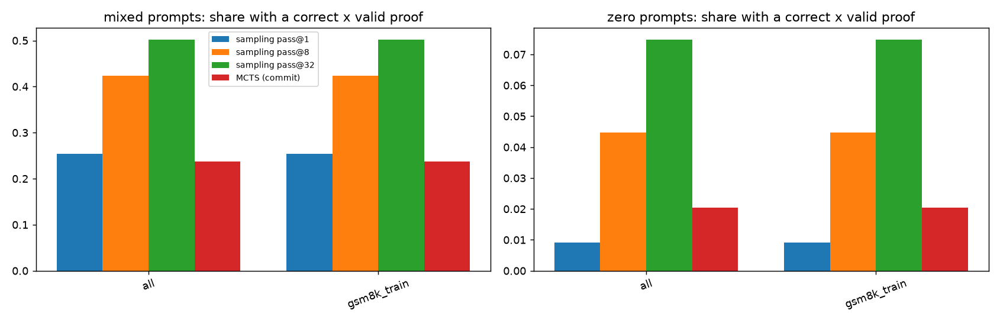
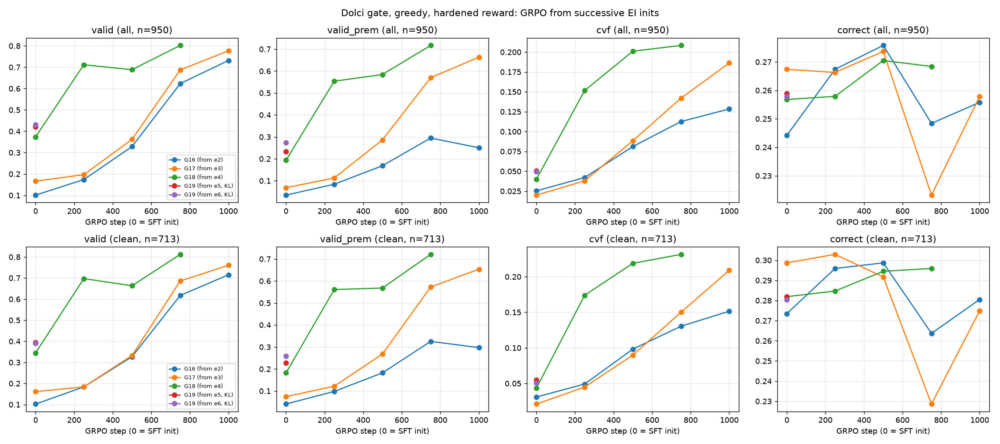
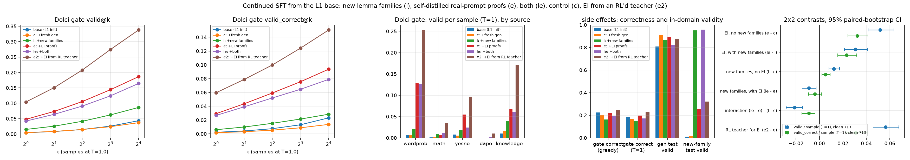
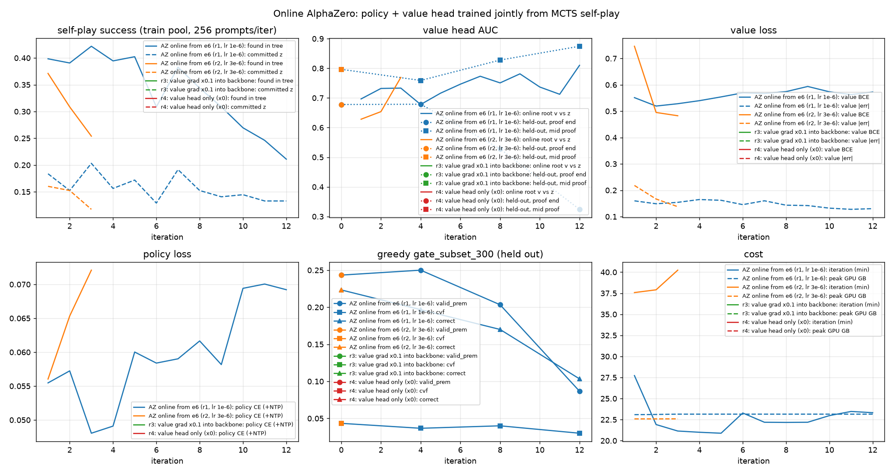

# Stage 3 (AlphaZero-style search), first results (2026-10-04)

Code:
- `scripts/az/mcts_decode.py`: line-level PUCT search.
- `scripts/az/value_probe.py`: frozen-backbone value probe.
- `scripts/analysis/az_search.py`: comparison of decoders.
- `scripts/az/build_selfplay_prompts.py`: self-play prompts.

Tables: `analysis/az_search.md`, `analysis/az_value_probe.md`. Model: e4 (EI round 4, `qwen35_2b_lc_libext_e4`).
Test set: 300 clean Dolci gate items, 60 per bench (`rlvl_data/az/gate_subset_300`). The clean items have no near-duplicate in any training pool.

## The search

Each node of the search is a proof prefix inside `<formal>`.
- **Expansion:** an expansion samples K=8 candidate next lines from the policy.
  - It drops every line that fails rlvl strict or the Stage-2 hardening. This is the same pruning as the guided DFS of 2026-10-02.
  - The priors are the empirical line frequencies, renormalized over the legal lines.
- **Selection:** PUCT with c=1.5, where an unvisited child gets its parent's mean value (first-play urgency).
- **Moves:** after 8 simulations, the search commits to the most-visited child and re-roots there. The budget is 64 expansions per item.
- **Terminal value:**
  - `one`: any checked `ans` line scores 1. This is a pure validity search.
  - `gold`: a terminal scores the true cvf. This is for self-play only.
  - `probe`: a terminal scores the value probe's prediction.
- **Leaf value:** `none` (the parent mean), or the probe.

## Result 1: without a correctness signal, search buys validity, not correctness

| decoder | valid_s2 | correct | cvf | sampled tokens / item |
|---|---:|---:|---:|---:|
| greedy | .187 | .207 | .020 | 251 |
| k16 majority | .120 | .243 | .013 | 3471 |
| k16 first-valid (best-of-16, checker as verifier) | **.540** | .197 | **.090** | 3471 |
| k16 pass@16 (oracle, not a decoder) | .540 | .437 | .100 | 3471 |
| guided DFS | .520 | .067 | .067 | 2924 |
| MCTS (value none, terminal one) | .470 | .060 | .060 | 6357 |
| guided DFS + greedy fallback | .520 | .207 | .067 | 3102 |

- **Both searches raise cvf over greedy, from .02 to .06–.07.** Their proofs are valid by construction.
- **The proofs they find are exactly as correct as greedy on the same items** (.128 vs .128). The checker only prunes invalid lines. Whether the formalization is faithful to the problem stays the model's job.
- **Best-of-16 sampling with the checker as verifier beats both searches at equal or lower compute** (cvf .090). Without a value that tracks correctness, line-level search is a less efficient way to sample valid proofs.
- **The cvf ceiling under sampling is low.** pass@16 cvf is .100, while pass@16 correct is .437. The model rarely writes a proof that is both valid and correct. This is a policy problem, so better selection alone cannot fix it.
- **Self-consistency barely helps.** Choosing the valid sample whose answer is most frequent among the 16 gives cvf .093.
  - Agreement does carry signal. A DFS proof whose answer equals the k16 majority is correct 15/73 times (.21); one that disagrees, 5/83 (.06).

## Result 2: a linear value probe on e4 sees difficulty, not correctness

**Setup:**
- **Data:** 16k logged GRPO completions (G16 steps 500–1000 and G17), with 165k prefix positions.
- **Features:** e4 last-layer (and layer-16) states at the end of the prompt and after every proof line.
- **Model:** a logistic probe with L2 regularization.
- **Split:** prompt-disjoint; test prompts are those with md5 % 5 == 0.

| target | AUC | within-prompt AUC (all depths) | within-prompt at the end |
|---|---:|---:|---:|
| correct | .904 | **.562** | .583 |
| cvf | .905 | .655 | .755 |
| valid | .862 | .672 | .760 |

- **The high overall AUC is prompt difficulty.** It is already .907 at the end of the prompt, before any proof line.
- **Within one prompt, the probe ranks correct vs incorrect continuations barely above chance (.51–.63).** That within-prompt ranking is the only thing search needs.
- **The cvf probe's within-prompt power is its validity component** (valid .76 vs correct .58 at the end).
- So a frozen-feature value would steer search toward validity again, which the checker already provides.
- Layer 16 is no better than the last layer.
- **Running:** probe-valued MCTS on the subset (job 11233) quantifies this end to end.

## Consequence for Stage 3

- **Test-time search with a learned value cannot fix correctness at this model size.** The bottleneck is the policy's faithfulness, not selection.
- **The AlphaZero lever is therefore the training loop.** Self-play with the true terminal reward (`--terminal gold`: only a valid *and* correct proof scores 1) finds verified-correct proofs. SFT on them then improves the policy.
- **What separates this from EI is search on prompts where sampling fails:**
  - **Round-1 self-play set:** 2,000 RL-train prompts (jobs 11231/11232). Per bench they are split into `mixed` prompts (the G16 teacher's cvf at n=16 is in (0,1)) and `zero` prompts (cvf rate 0).
  - **Key measurement:** the found-correct rate on `zero` prompts. Search pays off only if it is clearly above 0.
- **Next:**
  1. Harvest the gold-found trajectories.
  2. SFT e4 → az1 with the EI pipeline.
  3. Evaluate on the gate.
  4. Compare with an EI round at matched sampled tokens.
- **Probe follow-up:** a stronger value (a fine-tuned head rather than a frozen linear probe) only matters if az1's policy makes correct proofs common enough for within-prompt ranking to pay.

## Result 3 (12:20): self-play round 1, shard 0 (gold terminal, no value model)

e4 student, MCTS (K=8, 8 sims/move, 64 expansions, move-temp 1, `--value none --terminal gold`) on 1,000 round-1
prompts (556 `mixed`: the G16@750 teacher solved 1-15 of 16 samples; 444 `zero`: it solved none). 6,406 s on one
L40, ~8k sampled tokens per prompt. Status: found 322, out of budget 667, exhausted 11.

| difficulty | n | found | correct x valid_s2 (kept) | found proofs correct |
|---|---:|---:|---:|---:|
| mixed | 556 | .365 | .261 | .714 |
| zero | 444 | .268 | **.027** | .101 |

| bench | difficulty | found | kept |
|---|---|---:|---:|
| dolci_math | mixed / zero | .636 / .443 | .343 / .033 |
| dolci_wordprob | mixed / zero | .302 / .248 | .264 / .024 |
| gsm8k_train | mixed / zero | .257 / .173 | .218 / .025 |

On prompts the stronger teacher never solved, search does reach valid proofs (27%) but 90% of them commit to a
wrong answer: the gold terminal only rewards the root move, and with move-temp 1 the search still commits to valid
wrong lines. 12 new correct proofs on zero-rate prompts (157 kept rows in all, `az/selfplay_r1/harvest_s0.passing.jsonl`).
The control that decides whether search adds anything: e4 sampling at matched tokens (n=32, ~8k tokens/prompt) on the
same 2,000 prompts (job 11274, `rl_prompt_filter.py --ids`). The az1 SFT arm (`build_libext_ei_mixture.py --arms az1`
= e4 harvest + search-found proofs) waits for shard 1 and that control.

## Result 4 (13:50): search loses to plain sampling at matched cost → EI round 5 is sampling-based

**Matched sampling control (GSM8K half of the round-1 prompts).** The e4 student draws 32 samples per prompt (n=32, ~250 tokens each ≈ 8k tokens per prompt). The commit-MCTS self-play spent 9.2k tokens per prompt. On the 370 prompts both cover, the share with at least one correct × valid_s2 proof is:

| difficulty (G16@750 at n=16) | n | sampling pass@1 | pass@8 | pass@32 | MCTS (commit) |
|---|---:|---:|---:|---:|---:|
| mixed | 223 | .254 | .423 | **.502** | .238 |
| zero (teacher never solved) | 147 | .009 | .045 | **.075** | .020 |

- On the zero prompts, sampling alone solves 9 prompts and MCTS alone solves 1.
- Sampling at a quarter of the tokens (pass@8) already beats the search.
- The search commits to a line after 8 simulations. Most of its budget goes into valid but wrong setups that the checker cannot reject.

**Probe-guided MCTS (11275, 300 clean gate items).** The value probe guides both the search and terminal selection. cvf is .073, against .060 with no value function and .090 for k16 first-valid sampling. The probe helps a little but does not close the gap (`analysis/az_search.md`).

**Decision.** The next round is plain sampling EI. Arm **e5** = the e4 harvest (G16@750, n=16) plus the passing proofs from the e4 student's own 32 samples on the round-1 prompts, with the same cap, recipe and hardened filter. Chain: build 11285 → SFT 11286 → eval 11287, which starts after the Dolci sampling job 11281. The `--solve` pilot (11276, zero prompts, no move commitment) continues as the last test of whether search can reach prompts that sampling cannot. It had found 6 proofs among the first 19 finished prompts.

## Result 5 (14:15): full comparison, including the no-commit `--solve` search

The Dolci sampling half (11281) and the `--solve` pilot (11276) are finished. The table covers 1,370 round-1 prompts that both sampling (n=32) and commit-MCTS reached. Each cell is the share of prompts with at least one correct × valid_s2 proof.

| bench / difficulty | n | pass@1 | pass@8 | pass@32 | MCTS commit | MCTS solve |
|---|---:|---:|---:|---:|---:|---:|
| all / mixed | 765 | .208 | .435 | **.573** | .277 | – |
| all / zero | 605 | .007 | .032 | **.068** | .018 | .019 (n=311) |
| dolci_math / zero | 223 | .008 | .032 | .067 | .018 | .033 (n=122) |
| dolci_wordprob / zero | 235 | .005 | .023 | .064 | .017 | .016 (n=125) |
| gsm8k_train / zero | 147 | .009 | .045 | .075 | .020 | .000 (n=64) |

- **Cost.** Sampling uses about 231 tokens per sample, so about 7.4k tokens for 32 samples. Commit-MCTS uses 7.7k tokens per prompt and solve-MCTS 9.4k.
- **`--solve` search** (no move commitment; a wrong terminal kills its branch; 64 expansions):
  - It finds a correct proof on 8 of 444 zero prompts.
  - 422 prompts run out of the expansion budget.
  - Its most common rejection is `h_prem_numbers`, at 10.5k candidate lines.
- **Head to head on zero prompts.** Against commit search, sampling alone solves 34 prompts and search alone solves 4. Against solve search, the split is 22 to 3.

Conclusion: at this model scale, the policy's diversity across samples is worth more than tree search over lines. Without a value signal that recognizes a wrong problem setup, the tree spends its budget refining prefixes that are valid but wrong. So Stage 3 continues as sampling EI. Search returns only once a value or verifier can score setups. Possible routes are a trained outcome verifier or an RL-tuned value head.

**e5 data.** Adding e4's self-samples raises EI coverage from 1,679 prompts (e4: 4 proofs per prompt) to 2,338 prompts (e5: 3 per prompt) under the same 7,000-row cap. The SFT is job 11286 and the eval is 11287.

## Result 6 (20:30): GRPO baselines, G17@750 and L1_correct@3000

**G17 vs G16 at matched steps.** This is the greedy Dolci gate, rescored with the hardened reward. The script is `scripts/analysis/gate_hardened_rescore.py`, and the full table is in `analysis/gate_hardened_rescore.md`.

| step | G16 (from e2) valid_prem / cvf / correct | G17 (from e3) valid_prem / cvf / correct |
|---:|---|---|
| 0 (SFT init) | .035 / .025 / .244 | .068 / .020 / .267 |
| 250 | .084 / .042 / .267 | .113 / .038 / .266 |
| 500 | .168 / .081 / .276 | .286 / .088 / .274 |
| 750 | .295 / .113 / .248 | **.570 / .142 / .223** |
| 750, clean 713 | .325 / .130 / .264 | .572 / .150 / .229 |

- **The better EI init compounds under GRPO.** At step 750, G17's premise-valid rate is 1.9× G16's (.570 vs .295). Its cvf is higher by +.029 on all items and +.020 on the clean subset. G17@750 already beats G16 final at step 1000 (cvf .128).
- **Correctness erodes as validity rises.** G17's gate correct falls from .274 to .223 between steps 500 and 750. G16 shows the same dip (.276 → .248). So cvf is capped by correctness, and the cvf reward trades correctness away to gain validity. This matches the L1 picture.
- **L1_correct@3000.** The correctness-only reward reaches train-bench correct .593 and gate_all correct .473. Validity stays at 0, and correctness is still creeping up (.544 → .566 → .593 from step 2500 to 3000). L1_cvf has been flat at cvf ≈ .21 on the train benches since step 1250.
- **Implication for Stage 3.** Every lever so far (EI rounds, cvf-GRPO, search) moves validity, and none moves correctness. The next EI filter, or the next reward, should weight correctness explicitly. One option is a pass@k ≥ ½ prompt filter for EI. Another is a correct-heavy reward mix, such as correct + 0.5·cvf.

## Result 7 (22:45): EI round 5 (e5, self-distillation from e4's own samples)

e5 is e4's data plus the passing proofs from 32 samples of the e4 student. Training is continued SFT from the L1 base with the same recipe. The full table is in `analysis/libext_ei_arms.md`, and the hardened rescore is in `analysis/gate_hardened_rescore.md`.

| Dolci gate | e3 | e4 | **e5** | e5 − e4, all [95% CI] | e5 − e4, clean 713 |
|---|---:|---:|---:|---|---|
| greedy valid | .227 | .415 | **.459** | +.044 [+.018, +.072] | +.045 [+.013, +.079] |
| greedy valid·correct | .088 | .105 | **.121** | +.016 [+.001, +.032] | +.017 [−.003, +.037] |
| greedy correct | .267 | .257 | .259 | | |
| T=1 valid / sample | .160 | .305 | **.371** | +.066 [+.057, +.075] | +.056 [+.046, +.066] |
| T=1 valid·correct / sample | .068 | .083 | **.093** | +.010 [+.005, +.016] | +.009 [+.003, +.015] |
| valid@16 | .556 | .786 | **.845** | | |
| mixed@8 (valid) | .418 | .645 | **.695** | | |
| hardened: valid·prem / cvf (greedy) | .068 / .020 | .194 / .040 | **.234 / .051** | | clean: .229 / .055 |
| generator test valid / acc | .892 / .951 | .888 / .945 | .885 / .943 | | |

- **Self-distillation still pays, but less each round.** The e5 − e4 gain is about a quarter of e4 − e3 on greedy validity (+.044 vs +.187) and about half on T=1 valid·correct (+.010 vs +.015). It matters that e5 needed no RL teacher: the student's own sampled, checker-filtered proofs were enough to improve on it. That is the policy-improvement half of an AlphaZero loop, with sampling plus the checker as the improvement operator.
- **Correctness is still flat** (.257 → .259). Every EI round so far has raised validity and left correctness unchanged.
- **GRPO is still ahead on cvf.** G17@750 has hardened cvf .142, against e5's .051. EI is cheap, at roughly 1.5 h of sampling plus 6 h of SFT on one L40, and it compounds as an RL init (G17 vs G16, Result 6).
- **Data caveat.** The e4-sample gsm8k half of e5 lost its `--ids` and `--exclude-ids` arguments: `sbatch --export` split them on commas. As a result it covers 3,000 default gsm8k_train prompts that were not de-contaminated against the gate. The clean-713 columns are unaffected.

**Next (queued 22:40): EI round 6.** The e5 student samples 32 proofs on 3,000 gsm8k_train prompts (now de-contaminated) and the 1,000 round-1 Dolci prompts. e6 is e5's data plus these samples, then SFT and the eval suite. The jobs are 11546/11547 (sampling), 11548 (build), 11549 (SFT) and 11550 (eval), from `scripts/submit_ei6.sh`. Comparing e6 − e5 with e5 − e4 will show whether the self-distillation curve has saturated. A third point decides whether to keep iterating or to move the loop onto GRPO, i.e. G19 from the best EI init.

## Result 8 (2026-10-05 03:10): G17 finished; G18@250 already beats G17@750; RL erodes generator-task accuracy

Hardened greedy Dolci gate (`analysis/gate_hardened_rescore.md`, figure `reports/figures/gate_hardened_rescore.png`):

| model | step | valid_prem | cvf | correct | clean cvf |
|---|---:|---:|---:|---:|---:|
| G16 (from e2) | 1000 | .251 | .128 | .256 | .151 |
| G17 (from e3) | 750 | .570 | .142 | .223 | .150 |
| G17 (from e3) | 1000 | .663 | .186 | .258 | .209 |
| G18 (from e4) | 250 | .554 | .152 | .258 | .174 |

- G17 ends at cvf .186 (clean .209), +.058 over G16 at matched steps; the correctness dip at step 750 recovers by 1000 (.258).
- G18 reaches G17@750's level after 250 steps: a better EI init (e4 vs e3) cuts the GRPO steps needed by about 3x. This is the strongest evidence so far for "EI rounds, then GRPO from the best EI init".
- Generator test (2,000 in-domain logic items, `formal_eval`): GRPO erodes answer accuracy on the generator families. G16 .902 → .763 and G17 .901 → .762 between steps 250 and 1000; G17's `tools` family collapses to valid .01. G18@250: valid .770, acc .922. *Correction (04:10):* this happens although 3,000 of the 7,643 RL prompts are generator prompts. G17's training rewards show it too: valid_gen .80 → .65 and correct_gen .93 → .87 while cvf_dolci rises .02 → .18. Most generator groups are saturated, so their advantage is ~0 and nothing anchors that behaviour (the runs use `--beta 0`, no KL). The fix is a KL anchor to the SFT init, not more generator prompts.
- L1 correctness-only @3250: gate train-bench correct .540 (from .593 @3000), gate_all .428; it peaked around step 3000 and is now noisy. Validity stays 0.

Plan: when e6 lands, launch G19 = G18 recipe from the best EI arm with a KL anchor `--beta 0.02` (`scripts/submit_g19.sh <arm> [beta]`). The reference model costs ~4.5 GB on the L40.

## Result 9 (2026-10-05 05:15): L1 cvf@2000

Gate train benches, greedy (figure `figures/l1_convergence_train.png`):

| L1 arm | step | correct | valid_prem | cvf | gen-test cvf |
|---|---:|---:|---:|---:|---:|
| cvf (hardened) | 1500 | .310 | .291 | .223 | .648 |
| cvf (hardened) | 1750 | .321 | .309 | .214 | .596 |
| cvf (hardened) | 2000 | .307 | .333 | .230 | .626 |
| correct only | 2000 | .557 | 0 | 0 | 0 |
| correct only | 3000 | .593 | 0 | 0 | 0 |

- L1_cvf has plateaued on cvf at ≈ .22 since step 1250. valid_prem still creeps up (+.02 per 250 steps), but correctness is flat at ≈ .31, while the correctness-only arm sits at ≈ .55.
- The gap is now the L1 answer to "when does each converge": correctness-only converges in correctness by ~1500 steps (≈ .56). cvf converges in cvf by ~1250 (≈ .22) and in validity it has not converged by 2000. Its correctness never catches up, because training only on proofs means only the proved answers get credit.
- Compare with the EI-init GRPO runs: on all 950 gate items, L1_cvf@2000 has cvf .171, while G17@1000 has .186 in half the steps from a better init. L1 starts from the plain mixture SFT, which has valid ≈ 0 on Dolci.

## Result 10 (2026-10-05 07:20): EI round 6, then G19 from e6

e6 = e5's data + e5's own passing samples (32 per prompt, hardened filter) on 3,000 gsm8k_train prompts and the 1,000 round-1 Dolci prompts (figures `figures/libext_ei_arms.png`, `figures/gate_hardened_rescore.png`).

| gate (950 items) | e4 | e5 | e6 |
|---|---:|---:|---:|
| greedy valid (rlvl strict) | .415 | .459 | .473 |
| greedy valid·correct | .105 | .121 | .115 |
| valid@16 | .786 | .845 | .870 |
| valid·correct@16 | .258 | .296 | .288 |
| hardened valid_prem (greedy) | .194 | .234 | .275 |
| hardened cvf (greedy) | .040 | .051 | .050 |
| gen-test answer acc | .945 | .943 | .937 |

- e6 − e5: greedy valid +.014 [−.015, +.040] (n.s.), valid·correct −.006 [−.023, +.011] (n.s.); per-sample valid +.013 [+.004, +.022] (significant), per-sample valid·correct −.002 (n.s.).
- **Self-distillation has saturated.** Validity still creeps up, mostly in valid_prem (+.04, premise numbers stated), but correctness is flat at ≈ .26 for e3 through e6. EI rounds now mostly teach the model to write checkable proofs for the questions it already gets right. They do not teach it to solve more of them. Rounds 4→5→6 gained cvf +.011, +.011, −.001.
- So the next gain has to come from RL. G19 starts from e6 (the highest valid_prem, which is the cvf reward's validity term, and cvf tied with e5) with the G18 recipe plus a KL anchor (`--beta 0.02`).

## Result 11 (2026-10-05 08:50): G18@500, L1_cvf@2250, L1_correct@3500

Figures: `figures/gate_hardened_rescore.png`, `figures/l1_convergence_train.png`, `figures/l1_convergence_heldout.png`.

Dolci gate, greedy, hardened reward (all 950 items; clean = 713):

| model | step | valid_prem | cvf | correct | clean cvf |
|---|---:|---:|---:|---:|---:|
| e4 (SFT, G18 init) | 0 | .194 | .040 | .257 | .043 |
| G18 (from e4) | 250 | .554 | .152 | .258 | .174 |
| G18 (from e4) | 500 | .584 | **.201** | .271 | .219 |
| G17 (from e3) | 500 | .286 | .088 | .274 | .090 |
| G17 (from e3) | 1000 | .663 | .186 | .258 | .209 |
| L1_cvf (from plain mixture SFT) | 2250 | .437 | .178 | .231 | — |

- **A better EI init roughly halves the RL steps.** G18@500 (.201) already beats G17's final G17@1000 (.186) and L1_cvf@2250 (.178). G17@500 was at .088. Correctness stays at ≈ .26–.27 in every run; all the cvf gain is validity on answers the model already gets right.
- L1_cvf (train benches): valid_prem .333 → .447 between steps 2000 and 2250, the largest jump since step 1000; cvf .230 → .240; correctness flat (.307 → .309). Validity has still not converged at 2250 steps.
- L1_correct (train benches): correctness .593 (3000) → .540 (3250) → .527 (3500). It peaked around step 3000 and is now drifting down, so it converged at ≈ .55 ± .03 from step ~1500.
- Hack watch: 768 recent completions each from G18, L1_cvf and L1_correct. 4 contain a `x ; given` pattern (L1 runs), all with cvf 0.
- G19 (from e6, beta .02) failed twice on memory: the KL reference model OOMed at vLLM 0.2 (job 12165). At 0.15 vLLM could not hold one 262,144-token sequence (job 12174). It was relaunched (job 12221) with `--vllm-mem 0.15 --vllm-max-model-len 16384`; the training recipe is unchanged.

## Result 12 (2026-10-05 12:10): L1_cvf@2500, the plateau was not one

Figures: `figures/l1_convergence_train.png`, `figures/l1_convergence_heldout.png`.

| L1_cvf step | correct (train benches) | valid_prem | cvf | gate_all cvf | gen-test cvf |
|---:|---:|---:|---:|---:|---:|
| 2000 | .307 | .333 | .230 | .171 | .626 |
| 2250 | .309 | .447 | .240 | .178 | .712 |
| 2500 | **.361** | **.574** | **.286** | **.213** | .756 |

- Result 9's plateau reading ("cvf ≈ .22 since step 1250") was premature. Validity has been accelerating since step 2000 (+.11, then +.13 per 250 steps). Correctness has now also started to rise (.31 → .36), the first move since step 1000. It is still far below the correctness-only arm (≈ .55).
- On all 950 gate items L1_cvf@2500 (.213) is now level with or above the EI-init runs at similar compute: G18@500 has .201 and G17@1000 has .186. So for cvf, the EI init buys speed and not (yet) a higher ceiling.
- Out-of-distribution gate benches: valid_prem .60, but cvf stays ≈ 0. The validity skill transfers; the answers do not.
- Revised answer to the L1 question: correctness-only converges in correctness at ≈ .55 by ~1500 steps. validity·correctness has not converged in either metric at 2500 steps; validity is still climbing steeply.

## Result 13 (2026-10-05 15:25): G18@750; L1_correct is declining, not converged

Figures: `figures/gate_hardened_rescore.png` (EI SFT arms vs GRPO checkpoints), `figures/l1_convergence_train.png`, `figures/l1_convergence_heldout.png`.

**G18 (GRPO from e4), Dolci gate, greedy, hardened reward:**

| G18 step | valid | valid_prem | cvf | correct | clean valid_prem | clean cvf | clean correct |
|---:|---:|---:|---:|---:|---:|---:|---:|
| 0 (e4 SFT) | .374 | .194 | .040 | .257 | .182 | .043 | .282 |
| 250 | .712 | .554 | .152 | .258 | .561 | .174 | .285 |
| 500 | .688 | .584 | .201 | .271 | .568 | .219 | .294 |
| 750 | **.802** | **.717** | **.208** | .268 | **.721** | **.231** | .296 |

- From 500 to 750, validity (valid_prem) gains another +.13, but cvf gains only +.007, because correctness has not moved off the SFT level (.26–.27) at any G18 checkpoint. Every GRPO run so far (G16, G17, G18, L1_cvf) shows the same split: the cvf reward buys validity on answers the model already gets right, but not new correct answers. cvf is now capped by correctness: .208 of .268, so 78% of the correct answers already carry a valid proof.
- G18@750 is the best gate checkpoint on cvf, at .208 (clean .231). It is slightly below L1_cvf@2500 (.213), which has 3.3× more steps but started from the base SFT model.

**L1_correct (correctness-only reward), held-out correctness by step:**

| step | train benches | gate_all | gate_ood | gen-test |
|---:|---:|---:|---:|---:|
| 3000 | **.593** | **.473** | .136 | .927 |
| 3250 | .540 | .428 | .116 | .958 |
| 3500 | .527 | .419 | .116 | .928 |
| 3750 | .499 | .398 | .116 | .827 |

- Results 11 and 12 described correctness as converged at ≈ .55. It is not converged: held-out correctness has fallen in all three evals since its peak at step 3000 (−.09 on train benches, −.08 on gate_all). On-policy training rollouts show the same: Dolci correctness over the last 100 steps is .416, against a fitted plateau of .447. This looks like over-optimisation or drift past the optimum, not noise; three consecutive drops are well beyond the ±.03 seen earlier.
- Corrected L1 answer so far:
  - Correctness-only peaks at about step 3000, at .59 on train benches and .47 on gate_all, then degrades. Its best checkpoint, not its final one, is the fair comparison.
  - validity·correctness has not converged by 2500.
  - The correctness gap between the arms is about .23 at matched best checkpoints, against a cvf gap of +.21 in favour of the cvf arm (the correctness-only arm's cvf is 0).

## Result 14 (2026-10-05 17:15): L1_cvf@2750, validity near saturation, cvf now capped by correctness

Figures: `figures/l1_convergence_train.png`, `figures/l1_convergence_heldout.png`.

| L1_cvf step | correct (train benches) | valid_prem | cvf | cvf / correct | gate_all cvf | gate_ood valid_prem | gen-test cvf |
|---:|---:|---:|---:|---:|---:|---:|---:|
| 2250 | .309 | .447 | .240 | .78 | .178 | .408 | .712 |
| 2500 | .361 | .574 | .286 | .79 | .213 | .600 | .756 |
| 2750 | .349 | **.730** | **.303** | **.87** | **.227** | **.712** | .732 |

- Validity climbs another +.16 in 250 steps. 87% of correct answers now carry a valid proof with stated premises, so cvf can gain at most about .05 more without new correct answers. Correctness is flat (.36 → .35). The L1_cvf arm now shows the same split as G18 (Result 13): the cvf reward converts correct answers into verified ones but does not create correct answers.
- On all 950 gate items, L1_cvf@2750 (.227) is now the best checkpoint overall, ahead of G18@750 (.208).
- Prediction for the L1 question: L1_cvf converges in validity at about .75–.80 on train benches within the next 250–500 steps. After that, cvf is capped by correctness at about .30–.35, against L1_correct's peak correctness of .59 (step 3000). Under GRPO the price of validity is therefore about .24 correctness, and the cvf arm buys about .30 cvf for it, against ≈ 0 cvf for the correctness-only arm.

## Result 15 (2026-10-05 19:30): L1_correct@4000, decline has stopped

Figures: `figures/l1_convergence_train.png`, `figures/l1_convergence_heldout.png` (refreshed).

| L1_correct step | train benches | gate_all | gate_ood | gen-test |
|---:|---:|---:|---:|---:|
| 3000 | **.593** | **.473** | .136 | .927 |
| 3250 | .540 | .428 | .116 | .958 |
| 3500 | .527 | .419 | .116 | .928 |
| 3750 | .499 | .398 | .116 | .827 |
| 4000 | .510 | .407 | .120 | .894 |

- After three consecutive drops, correctness ticks back up slightly at step 4000 (+.01 on every split). The correctness-only arm has settled at ≈ .50–.51 on train benches and ≈ .40–.41 on gate_all. That is about .08 below its step-3000 peak and still well above the SFT start (.284 / .224) and above the cvf arm (.35 / .26).
- L1 answer, correctness-only arm: correctness rises fast (most of the gain by step 250, at .48), peaks at ≈ .59 around step 3000, and then settles near ≈ .51. Validity stays at 0 throughout, because the arm abandons the `<formal>` format by step 250.
- L1_cvf@3000 is still pending; the run is at ~2750+ steps.

## Result 16 (2026-10-05 21:40): online AlphaZero started (policy and value head learned together)

What the user asked for: the model explores with MCTS and learns from the solutions it finds. The policy (line-level visit-count cross-entropy plus NTP on found proofs) and a value head on the last hidden state are trained online, together, from e6. Design is in `docs/research_plan.md` (change log 2026-10-05); code is in `scripts/az/az_train.py`. Each iteration:
- search: 256 prompts, K=8 candidate lines per expansion, 8 simulations per move, up to 64 expansion rounds; terminal reward = gold cvf;
- then one training pass over the search data, then a weight sync into the colocated vLLM.

Smoke test (16 prompts, 4 iterations including a resume) passed. Peak GPU memory is 23 GB with bf16 weights on the GPU and fp32 master weights and AdamW on the CPU.

| | iter 0 (= e6) | iter 1 |
|---|---:|---:|
| gate_subset_300 greedy valid / valid_prem / cvf / correct | .390 / .243 / .043 / .223 | (next eval at iter 4) |
| held-out value AUC, proof end / mid proof (vs gold cvf) | .678 / .797 | |
| self-play: found in tree / committed z | | .398 / .184 |
| online value AUC (root value vs z) | | .697 |
| iteration time | | 27.7 min (search 22, train 5.6) |

Figure: `figures/az_online_curves.png` (refreshed every tick).

### Result 16b (2026-10-05 22:15): online AZ, iterations 1–4

| iter | found in tree | committed z | gold proofs kept for NTP | online value AUC | policy loss | value BCE | value abs err | min/iter |
|---:|---:|---:|---:|---:|---:|---:|---:|---:|
| 1 | .398 | .184 | 47 | .697 | .055 | .551 | .160 | 27.7 |
| 2 | .391 | .152 | 39 | .732 | .057 | .519 | .149 | 21.9 |
| 3 | .422 | .203 | 52 | .733 | .048 | .528 | .154 | 21.1 |
| 4 | .395 | .156 | 40 | .678 | .049 | .540 | .165 | 21.0 |

Greedy gate_subset_300 at iter 4: valid .400, valid_prem .250, cvf .037, correct .197, against .390 / .243 / .043 / .223 at iter 0. Held-out value AUC is .679 at the proof end and .759 mid proof (iter 0: .678 / .797).
- After 64 optimizer steps at lr 1e-6, nothing has moved beyond noise yet (gate n=300, so ±.02–.03). The first meaningful read is at iter 16.
- Search finds a gold proof for ≈ 40% of pool prompts, but the committed trajectory reaches one only ≈ 17% of the time. That gap is the learning signal: the visit counts point the policy at the lines that led to found proofs.

## Result 17 (2026-10-05 23:15): G18 final (1000 steps), G19@250 (from e6, KL 0.02), L1_cvf@3000

Gate (950 items, greedy, hardened rescore; `analysis/gate_hardened_rescore.md`, `figures/gate_hardened_rescore.png`):

| model | valid | valid_prem | cvf | correct | clean cvf | clean correct |
|---|---:|---:|---:|---:|---:|---:|
| e4 (SFT) | .374 | .194 | .040 | .257 | .043 | .282 |
| G18@750 | .802 | .717 | .208 | .268 | .231 | .296 |
| **G18@1000 (final)** | **.842** | **.726** | **.230** | .277 | **.260** | .310 |
| e6 (SFT) | .430 | .275 | .050 | .258 | .051 | .281 |
| G19@250 (from e6, KL) | .579 | .462 | .161 | **.287** | .171 | .309 |
| L1_cvf@3000 (gate_all) | .832 | .698 | .220 | .254 | — | — |

- G18 final is the best gate model on cvf (.230 all, .260 clean), just ahead of L1_cvf at its peak (.227 @2750). L1_cvf@3000 dips slightly (.220). Correctness stays at .25–.29 in every run.
- G19 from e6 starts higher: at 250 steps it reaches cvf .161, against .152 for G18@250, and it has the highest correctness of any GRPO checkpoint, .287. The KL anchor seems to keep correctness from eroding. It is too early to tell whether this lifts the correctness ceiling.
- L1_cvf@3000, train benches: correct .336, valid_prem .726, cvf .294. This is flat against 2750 (.349 / .730 / .303). **Validity has converged at ≈ .73 and cvf at ≈ .30, both around step 2750.** That confirms the Result 14 prediction. The L1 answer so far:
  - correctness-only converges in correctness at .59 (peak, step 3000) and then settles at ≈ .51;
  - validity·correctness converges at validity ≈ .73 and cvf ≈ .30 (correctness ≈ .34) by step ~2750.
- A second online AZ arm, r2 (lr 3e-6, seed 1, otherwise identical), started on the L40 that G18 freed. It gives a faster read on whether the search signal moves the gate at all. Output: `rlvl_data/az/online_e6_r2_lr3e6`.

### Result 16c: AZ r1, iterations 5–9 and the iteration-8 gate (2026-10-06 00:15)

| iter | found | z | value AUC (online) |
|---:|---:|---:|---:|
| 5 | .402 | .172 | .716 |
| 6 | .309 | .129 | .746 |
| 7 | .383 | .191 | .773 |
| 8 | .344 | .152 | .751 |
| 9 | .309 | .141 | .781 |

Gate subset (300 items):

| iter | valid | valid_prem | cvf | correct | value AUC end / mid |
|---:|---:|---:|---:|---:|---:|
| 0 | .390 | .243 | .043 | .223 | .678 / .797 |
| 4 | .400 | .250 | .037 | .197 | .679 / .759 |
| 8 | .333 | .203 | .040 | .170 | .528 / .828 |

- **Value head (online):** improving, with AUC rising from .70 to about .78.
- **Value head (gate):** end-of-proof AUC is unreliable there, because cvf has only ~12 positives in 300.
- **Policy:** drifting slightly down. Correct went .223 → .170 and valid .39 → .33, about 2 standard errors, and the self-play find rate fell from about .40 to about .32.
- **Likely cause:** with only about 55 expansions per problem, the visit-count target is mostly self-imitation of near-prior visits, plus NTP on the found proofs. This is a hypothesis.
- **Next:** r2 (lr 3e-6) should show the sign of the drift sooner. If both arms keep degrading by iter 16, the next change is policy targets only on moves with a decisive visit margin, or proof-only NTP (EI-style), keeping the value head online.

### Result 16d: online AZ r1/r2 collapsed; the cause and the fix (2026-10-06 01:20)

| iter | valid | valid_prem | cvf | correct | value AUC end / mid |
|---:|---:|---:|---:|---:|---:|
| 0 | .390 | .243 | .043 | .223 | .678 / .797 |
| 8 | .333 | .203 | .040 | .170 | .528 / .828 |
| 12 | .153 | .087 | .030 | .103 | .324 / .874 |

**r1 gate (300 items).** The policy collapsed.
- **Self-play find rate:** fell from .40 to .21.
- **Self-play failure counts, iter 1 → 12:**
  - checker `parse` failures rose from 679 to 2053;
  - `h_dup_premise` (repeated lines) rose from 131 to 1884.
- **The text stays readable:** the proofs still look like proofs but stop working.
- **r2 (lr 3e-6):** went the same way faster. Its find rate fell from .37 to .25 by iter 3.

**Diagnosis.** The value head's weights barely moved in 12 iterations (‖w‖ 1.677 → 1.667, bias −3.791 → −3.791).
- **Cause 1:** one global gradient clip (pre-clip norm ≈ 26, clipped to 1) covered the backbone and the head together. That gave the head an effective step about 26× below its lr.
- **Cause 2:** the value BCE gradient reached the shared backbone at full weight.
- **Result:** the value AUC improved (online .70 → .81, held-out mid-proof .80 → .87) because the backbone bent its hidden states toward the frozen head.
- **Why that breaks the policy:** the value is read at each line's last token, and that same hidden state predicts the next line's first token. Bending it corrupts the next-line distribution, which matches the parse and duplicate failures above.

**Fix (in `az_train.py`).** Training stays joint, with the value head on the hidden state.
- **Separate clipping:** the head and the backbone are clipped separately.
- **New flag `--value-backbone-scale`:** sets the fraction of the value gradient that reaches the backbone. The new default is 0.1.

**New arms** (both from e6, lr 1e-6, otherwise as r1):

| arm | value gradient into backbone | tests |
|---|---:|---|
| r3 | 0.1 | joint training at reduced value weight |
| r4 | 0 | whether the policy loss alone (visits + NTP on found proofs) is stable |

**Interpreting r3 vs r4:**
- If r4 holds but r3 still drifts, the value gradient needs a smaller fraction.
- If r4 also drifts, the visit-count policy target itself is the problem.

The collapsed r1 model is kept at `online_e6_r1/ckpt-0012` for comparison.

